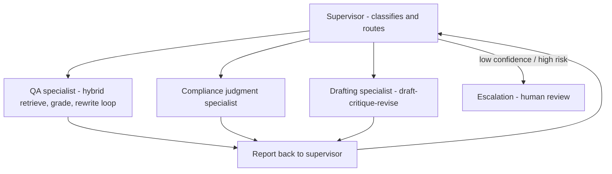
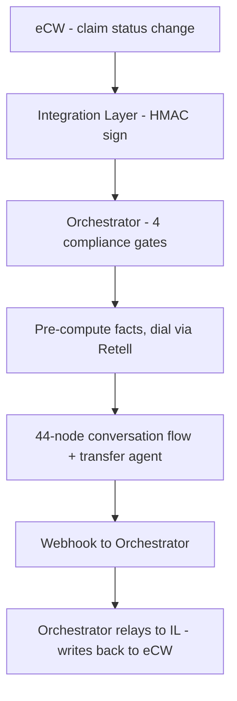
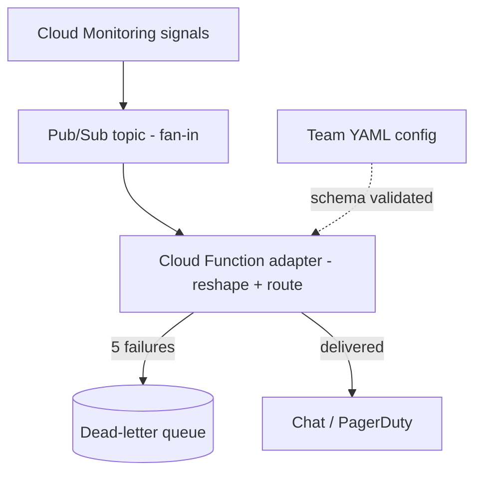
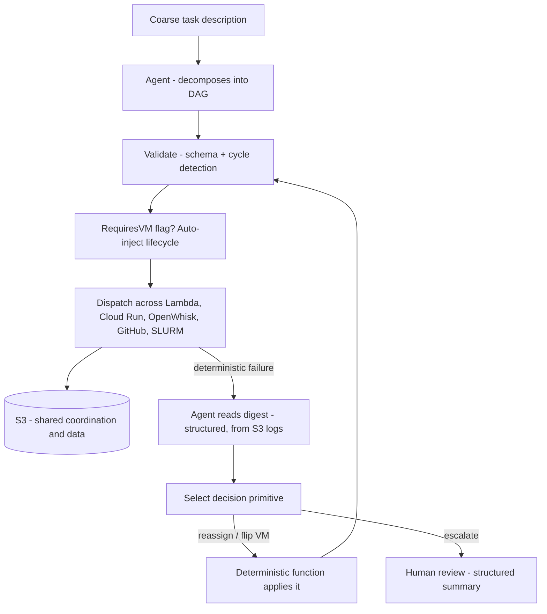
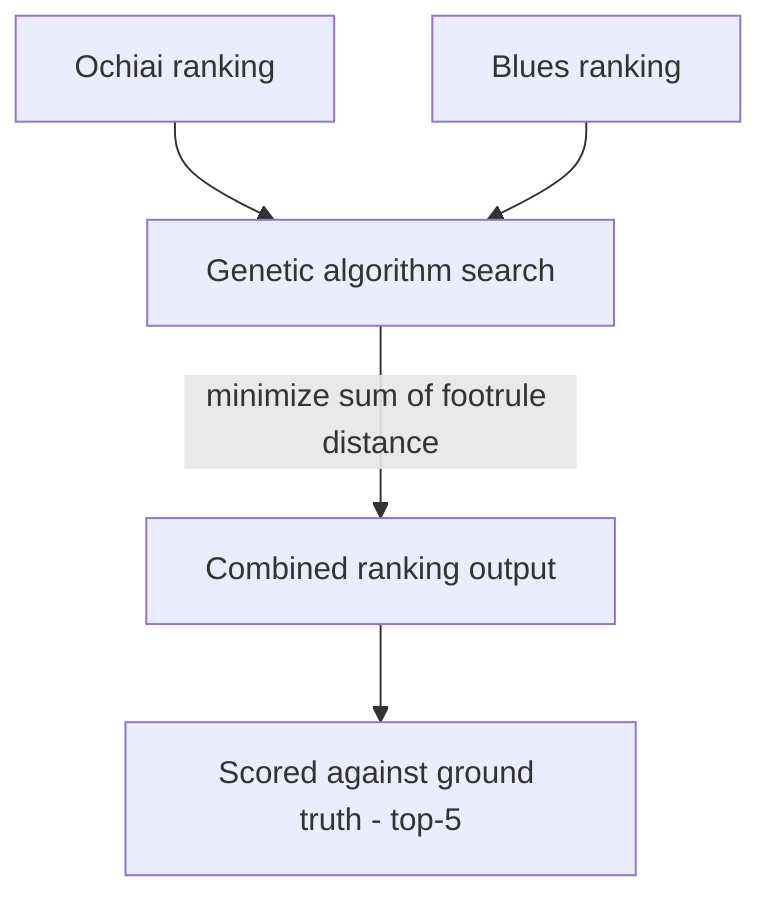
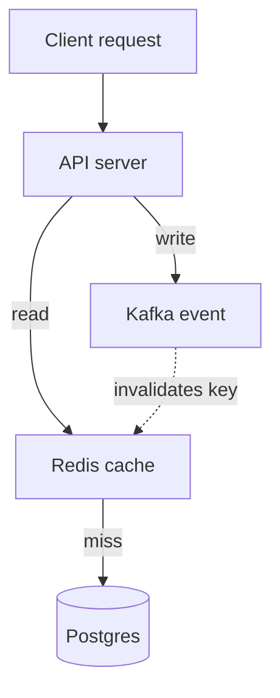
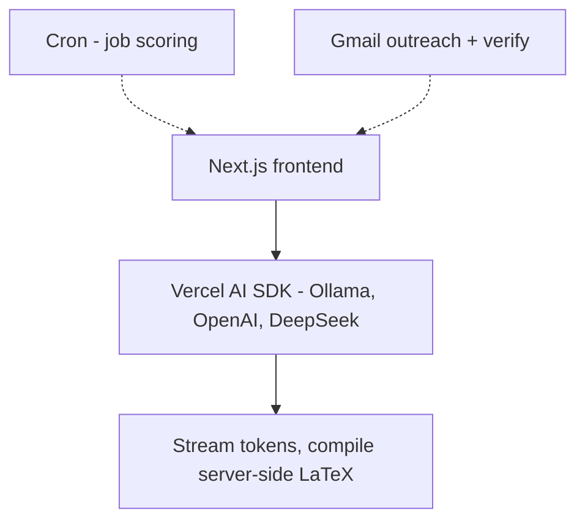

# Oracle Senior AI Software Engineer - Project & Experience Deep-Dive Prep (v2, Unified)

Candidate: Ashish Ramrakhiani | Req 339619 | IC3, OCI AI Innovation
Loop: Aug 12-14, 2026 - Hesam (HM), Arshdeep (System Design), Haoran (DSA/AI-ML), Ashley (BarTender)

---

## What changed in this version

This replaces the two-document split (Oracle_Project_Deep_Dive_Prep.md + interview-prep-lili-voice-and-cloud-ops-2026-08-03.md) with one file, and corrects two sections against real source material:

1. LiliSolutions is now included - previously excluded "per your request." Given the JD (production AI agents, observability, rollout controls, evaluation) maps almost one-to-one onto your Lili work, this is now the lead section, not an omission.
2. BugSleuth corrected against the real ICSE 2025 submission (paper/paper.tex, paper/icse25/) - the fitness mechanism was a defensible guess before; it's now accurate.
3. EphFlow corrected against the real camera-ready paper (Ephflow_camera_ready.pdf) - the published system is deterministic DAG/VM orchestration middleware, not an LLM-driven agent. Per your confirmation, a separate LangChain layer sits on top of it that isn't in the paper; that layer is reconstructed below as the most technically consistent design given the real substrate - flagged clearly, verify before using live.

Format per section: facts table, then general walkthrough answers, then hardest-question bank. Read, don't memorize verbatim.

---

## 1. LiliSolutions - Founding AI Software Engineer (Mar 2026 - Present)

Three shipped systems. This is your strongest section for an OCI AI Innovation interview - lead with it when a question is open-ended ("tell me about a project").

### 1A. Tome Raider - multi-agent RAG compliance assistant

| | |
|---|---|
| Framing | Core retrieval loop (contextualize, hybrid retrieve, grade, rewrite, generate) is shipped and running in production. The supervisor and specialist layer is the current architecture built on top of that core - QA specialist is the existing loop, promoted; compliance-judgment, drafting, and escalation are the newer specialists. |
| Stack | Python 3.12, FastAPI, LangGraph 1.x, Supabase Postgres + pgvector, gpt-4o-mini, text-embedding-3-small (1536-d), Next.js 16 frontend, LangSmith observability, Render (IaC blueprint) |
| Retrieval loop | contextualize (last 6 turns) -> hybrid retrieve (pgvector + Postgres FTS, fused via RRF, c=60) -> optional LLM rerank -> grade (threshold 0.5) -> rewrite-and-retry (max 2) -> generate w/ citations, or honest fallback |
| Security/governance | Prompt-injection screening + PII masking (in and out), per-user Postgres RLS, stateless ES256/JWKS auth, rate limit 20/min, response caching (TTL 300s) |
| Numbers | retrieval_k=4, rerank_candidates=10, chunk_size=1000/overlap=200, max_rag_retries=2 |

Q. Tell me about your compliance assistant / RAG project.
A: I built Tome Raider as a multi-agent RAG system for a multi-tenant compliance assistant. A supervisor classifies each incoming query and routes it to one of several specialists rather than treating every question the same way: a QA specialist for direct fact lookups, a compliance-judgment specialist for questions asking whether a practice satisfies a regulation, a drafting specialist for synthesis tasks like memo generation, and an escalation path for anything low-confidence or high-risk. The QA specialist is the core retrieval loop, shipped and running - contextualize the follow-up against recent conversation history, hybrid-retrieve using both vector similarity and Postgres full-text search fused with Reciprocal Rank Fusion, grade whether the retrieved context can actually answer the question, and if not, rewrite the query and retry - up to twice - before falling back honestly rather than hallucinating. The compliance-judgment specialist needs its own retrieval source for policy documents plus a stricter grading threshold and dual-citation, since a false positive there carries more risk. The drafting specialist swaps the retrieval-rewrite loop for a draft-critique-revise loop, since its failure mode is internal inconsistency across a longer document, not insufficient context. All four specialists share one checkpointer state and RLS-scoped corpus, and report back to a single supervisor rather than talking to each other directly, which gives a clean audit trail of which specialist handled a request and why - a real requirement in a compliance domain, not just good practice.

Q. Why route through a supervisor instead of a fully decentralized set of peer agents that hand off to each other directly?
A: Auditability, mainly. In a compliance domain, "why did the system decide to escalate this to a human" or "which specialist actually answered this question" needs to be a traceable, single-point answer, not something you reconstruct from a chain of peer-to-peer handoffs. A supervisor pattern is also simpler to reason about failure modes for - if a specialist fails, control returns to one place, not to whichever peer happened to hand off last. The cost is that the supervisor is a bottleneck and a single point of routing failure, which is a real tradeoff, but for this domain I'd take that over the debugging complexity of a mesh architecture.

Q. Walk me through a real example, end to end, across a multi-turn conversation - and how are the agents actually coordinating?
A: Take a three-turn conversation on one thread. Turn one, "what's the data retention period in our vendor agreement" - supervisor classifies this as a direct lookup, routes to the QA specialist, which runs its existing loop unchanged and returns "90 days after termination" with a citation. Turn two, "does that satisfy GDPR Article 5(1)(e)" - structurally different, this is judging a fact against an external rule, not finding a fact, so the supervisor routes to the compliance specialist instead. That specialist needs the vendor clause, which it pulls straight out of the checkpointed state from turn one rather than re-retrieving, plus the actual GDPR text, which almost certainly isn't in the user's uploaded corpus at all - so the compliance specialist would need its own retrieval tool pointed at a separate curated regulations corpus, which is a concrete example of what "specialist" buys you architecturally: different tools and different retrieval scopes, not just a different prompt over the same data. Say the judgment is genuinely ambiguous here - GDPR's "no longer than necessary" language doesn't map cleanly onto a fixed 90-day clause - so the compliance specialist's own grading fails even after its retry allowance, and the topic hits high-risk keywords, so it escalates: human review, with the citations already attached so the reviewer isn't starting cold. Turn three, "draft a memo summarizing what we found" - the drafting specialist pulls from that same checkpointed state, turn one's fact and turn two's finding including its escalation status, and synthesizes a memo, with the critique step specifically checking that the memo doesn't accidentally claim "confirmed compliant" when the real status was "escalated, unresolved."

On coordination specifically - it's not agents passing messages to each other. It's one shared, checkpointed state object that every specialist reads from and writes to, scoped to the thread ID. When the compliance specialist needed the 90-day clause in turn two, it didn't ask the QA specialist for it, it just read it out of shared state, because the checkpointer already had it from turn one. The actual routing mechanism is a Command object - the supervisor's output bundles a goto field naming the next node together with a state update, in one object. Each specialist is a subgraph invoked by name, and when it finishes, it returns its own Command with goto back to the supervisor, plus its findings written into shared state. That's simpler to reason about than peer-to-peer handoff, and it's what makes the audit trail clean - LangSmith sees one continuous state history, not a scattered set of inter-agent messages.

Q. Explain RRF like I'm a staff engineer.
A: I run two ranked lists - dense similarity search over pgvector embeddings, and sparse full-text search via Postgres ts_rank. Each result gets a score of 1/(k+rank) in each list it appears in, and I sum across lists. The reason to fuse ranks instead of normalizing and averaging raw scores is that cosine similarity and BM25-style scores live on incomparable scales - a 0.82 cosine similarity and a 14.3 text-rank score don't mean the same thing, and naive normalization is sensitive to whatever's in the corpus that query. Rank position is scale-invariant by construction, which is what makes RRF robust without needing score calibration. c=60 controls how sharply top ranks dominate versus how much a present-but-lower-ranked document still counts.

Q. Reranking of what, exactly - the raw embeddings?
A: No - reranking re-scores the retrieved chunks, not the embeddings themselves. The distinction matters: initial hybrid retrieval is optimized for speed and recall over precision - it's scanning the whole corpus using cheap vector math, cosine similarity for the dense side, keyword matching for the sparse side, pulling back a wider candidate pool of around 10. Reranking then takes that already-narrowed pool of 10 and re-scores it with a slower, more accurate method - the standard approach is a cross-encoder, which is architecturally different from the bi-encoder used for retrieval. A bi-encoder embeds the query and each document separately and compares vectors afterward - fast, but the query and document never actually interact during encoding. A cross-encoder feeds the query and one candidate document together into the same model pass, so it can directly attend to how they relate - much more accurate at judging true relevance, but too slow to run against an entire corpus, which is exactly why it only touches the pre-filtered top-10, not everything retrieval could have returned. Retrieval is fast, broad recall; reranking is slow, precise re-ordering of a small set.

Q. How is grading actually calculated - walk me through an example.
A: Grading is a single pass/fail judgment on the retrieved context as a whole, not a per-chunk score the way reranking is. Concrete example: a user uploads a 40-page vendor contract and asks "what's the termination notice period?" Hybrid retrieval and RRF pull back four chunks - one on payment terms, one on liability caps, one on the renewal notice period, one on data handling. All four are topically close, contract-language-adjacent, but none of them actually address termination. Grading is a small, fast LLM call - forced into structured output, not prose, so something like a JSON field indicating sufficient or not - given the question and those four chunks, asking essentially "can I answer this from what's here." It correctly returns insufficient, because nothing in that batch covers termination, and that's the check against the 0.5 threshold failing. This pattern - contextualize, retrieve, grade, rewrite-and-retry - is LangGraph's own published Corrective RAG reference architecture, which is the standard, defensible version of this mechanism.

Q. What happens on a failed grade - how does the rewrite know what to fix?
A: The rewrite isn't a blind retry of the same query - it's given three things: the original question, the query that was actually searched, and the grading signal that said it wasn't enough. In the contract example, the rewrite would steer explicitly toward "contract termination clause, early termination, notice period for termination" rather than the more generic original phrasing, because that's the gap the failed grade implicitly revealed - present chunks were about renewal, not termination, so the rewrite pushes toward the term that's actually missing. That rewritten query goes back through hybrid retrieval, pulls a new set that this time includes the actual termination clause, and grading runs again - passes, generation proceeds. If it fails a second time, the loop breaks to the honest fallback instead of a third attempt, since two failed rewrites is a stronger signal the document genuinely doesn't contain the answer than that the query phrasing is still the problem.

Q. How do follow-up questions carry context - what actually gets sent to the LLM to keep answers consistent turn to turn?
A: Two separate mechanisms working together. First, conversation state itself has to persist between turns, not just within one - LangGraph's Postgres checkpointer (the second connection pool we discussed under the production gotcha) checkpoints the full graph state against a thread ID after every turn. When the next message comes in on that thread, the graph loads the checkpointed history first rather than starting blank. Second, the contextualize step takes the last 6 turns from that loaded history and rewrites the new follow-up into a standalone question before it touches retrieval at all. Concrete example: turn one, "what's the termination notice period?" answers "30 days written notice." Turn two, "what about for the renewal option instead?" - on its own that's unanswerable, "instead" refers to nothing without turn one. Contextualize rewrites it into something like "what is the renewal-option provision, as opposed to the termination notice period" before hybrid retrieval ever sees it - the rest of the pipeline only ever operates on the resolved, self-contained version, never the ambiguous original.

Q. Why 6 turns specifically, and not the full conversation history?
A: Every turn included in the contextualize step costs tokens and dilutes the model's attention on what actually matters for that specific rewrite - an unbounded window grows cost linearly as a conversation gets longer, for a marginal benefit past a certain point since most follow-ups reference only the last exchange or two. 6 turns is a bounded window sized for typical follow-up chains - "what about X" then "how does that compare to Y" - without unbounded growth. The honest edge case: if a follow-up on turn 20 needs context from turn 1, that's a real limitation of a fixed window, not something the architecture handles gracefully - worth acknowledging directly rather than pretending the window is unlimited.

Q. What are the five RAG failure modes, and which is most common?
A: Bad chunking, embedding/vocabulary mismatch between query and document language, retrieval noise, context overflow or lost-in-the-middle, and hallucination despite good context. In practice, roughly 90% of "wrong answer" cases trace back to retrieval failures, not generation - so when something's wrong, I check the retrieved chunks before I look anywhere else.

Q. Reconcile: resume says "10K+ regulatory documents" and "40% analyst time reduction" - what's actually measured?
A: Honestly - there isn't a fixed 10,000-document regulatory corpus loaded in the shipped app; it's multi-tenant, per-user uploads, and the architecture is what would harden onto a regulatory corpus at that scale. Same with the 40% figure - I don't have a measured analyst-time KPI from this codebase. What I can defend is that the grade/rewrite loop measurably cuts retrieval misses and false-confidence answers versus naive RAG, which is the mechanism that would produce time savings in a real deployment. I'd rather give you the real mechanism than a KPI I can't back up if you ask how it was measured.

Q. Why Postgres/pgvector over a dedicated vector database?
A: At this scale, one system for documents, embeddings, checkpoints, RLS, and relational metadata is simpler to operate than standing up a separate vector store and still needing Postgres for everything else. Supabase gives me auth and pgvector together. At tens of millions of vectors I'd revisit - HNSW tuning, connection pooling headroom, or a dedicated store - but I size infrastructure decisions against actual projected scale, not a default assumption that a specialized tool is always better.

Q. What's a real production gotcha you hit?
A: Render's free tier can't reach Supabase's IPv6 direct connection, so I had to use the IPv4 session pooler, which caps around 15 concurrent clients. The app opens two separate pools - SQLAlchemy and the LangGraph checkpointer - so I had to budget connections carefully (roughly 3+2+4) to stay under that limit, and disable prepared statements for pgbouncer compatibility. Miss that budget and you get intermittent 500s that look random until you trace it back to connection exhaustion.

### Second-order follow-ups (if pressed further on the rewrite loop)

Q. What stops the rewrite-and-retry loop from looping forever, or from rewriting into a worse query than the original?
A: There's a hard cap of 2 retries - after that the system falls back to an honest "I don't have enough information" response rather than continuing to search, so infinite looping isn't possible by construction. On the "worse query" risk - the rewrite step doesn't operate blind; it's given the original question, the previous query attempt, and the grading signal that said the retrieved context was insufficient, so the rewrite is informed by exactly what didn't work, not a random new guess. It's not guaranteed to always improve - a genuinely ambiguous or out-of-corpus question can fail even after 2 rewrites - but that's precisely the case the fallback exists for, and I'd rather the system admit it can't answer than confidently rewrite its way into a plausible-sounding wrong answer.

Q. If two rewrite attempts still fail, what does the "honest fallback" actually say, and how do you keep that from feeling broken to the end user?
A: It states plainly that the available documents don't contain enough information to answer confidently, rather than a generic error - the distinction matters because a generic error reads as the system being broken, while an honest "not found in your documents" reads as the system working correctly and just not having the answer. That's a UX decision as much as a technical one: a RAG system that never says "I don't know" is optimizing for the wrong thing.

### Second-order follow-ups (if pressed further on Postgres/pgvector and the pooler gotcha)

Q. You said you'd revisit pgvector at tens of millions of vectors - what specifically breaks first, and what's the actual migration path if you had to move?
A: HNSW index build and query time degrade as the vector count grows into the tens of millions, and more concretely, index rebuilds get expensive and can compete with production query load if not scheduled carefully - that's the practical ceiling before raw storage or query latency becomes the binding constraint. The migration path I'd take first is tuning before switching - HNSW parameter tuning (m and ef_search) and read-replica offloading for vector queries specifically, since that buys meaningful headroom without an architecture change. If that's not enough, the actual migration is a dual-write period - writing new documents' embeddings to both pgvector and a dedicated store, backfilling historical data, and cutting over reads once the new store is validated - rather than a hard cutover, since a RAG system's correctness depends entirely on retrieval working during the transition.

Q. The connection pool budget - 3+2+4 under a 15-client cap - is tight. What happens the moment you add one more service or worker that also needs a DB connection?
A: It breaks immediately unless the budget is revisited - that's the honest answer, and it's the real fragility of a hard-coded budget against a hard external cap. The fix isn't just "raise the cap," since that's Render's free-tier limit, not something I control; it's either moving off the free tier to get a higher connection cap, or introducing a proper connection multiplexer like pgbouncer in front of the app's own pools so the app-level pool count stops being the binding constraint. I'd treat hitting that ceiling as a signal to upgrade infrastructure tier, not a signal to shave the budget thinner, since a thinner budget just moves the failure mode from "can't add a new service" to "occasional exhaustion under normal load."

---

### 1B. HIPAA-aware patient-collection voice bot

| | |
|---|---|
| Honest framing | Shipped to staging/QA with production scaffolded - not live with real patients yet. Say "shipped the platform to staging with prod scaffolded," never "live in production for patients." |
| Stack | Python, FastAPI, Cloud Run, Retell SDK, GPT-4o/GPT-5.1 conversation flow, Firestore (per-tenant) |
| Architecture | eCW (claims) -> Integration Layer (owns all EHR surface, HMAC-signs requests) -> Cloud Run orchestrator (gates, dynamic vars, dial) -> Retell conversation flow (44 nodes + 3-node transfer agent) -> webhook -> outcomes written back through IL |
| Security gates (4) | HMAC request auth, calling-window enforcement (8am-6pm M-F), hashed DNC opt-out (SHA-256), TCPA compliance flags |
| Eval harness | 108-scenario suite gated in CI; blocks merge on critical-scenario regression |

Q. Tell me about the voice bot.
A: It's an outbound, multi-channel - voice, SMS, email - system that collects patient-owed balances after insurance has paid, triggered when a claim hits a specific status in the practice's EHR. The load-bearing architectural decision is that the bot itself has zero EHR surface - it never reads or writes the EHR directly. An Integration Layer owns that entirely, generates the balance and statement, and HMAC-signs a request to my orchestrator, which runs pre-dial compliance gates, pre-computes every fact the agent will speak - the agent does zero math live - and places the call through Retell. Outcomes flow back through the same HMAC-signed boundary so the Integration Layer, not the bot, writes the clinical note. That boundary is what keeps PHI risk and EHR fragility isolated from the conversational AI surface.

Q. Walk me through the four security gates.
A: HMAC request authentication verifies the inbound request actually came from the Integration Layer and wasn't forged or replayed. Calling-window enforcement blocks outbound dialing outside 8am-6pm Monday through Friday, regardless of what the trigger says, because that's a hard compliance requirement, not a preference. DNC opt-out is enforced via a hashed identifier so a patient who's opted out can never be re-dialed, and that hash check happens before dial, not as a post-hoc filter. TCPA compliance flags gate consent state per channel - SMS and voice have different consent requirements, and the gate has to reflect that per patient, not apply one blanket rule.

Q. What is an HMAC-signed request, mechanically - what is HMAC, and what does the actual request look like?
A: HMAC is a hash-based message authentication code - not encryption, the message stays readable, but it proves two things at once: integrity, that the message wasn't altered in transit, and authenticity, that it really came from whoever holds the shared secret. Both sides - Integration Layer and the orchestrator - hold the same secret key, known to no one else. IL builds the payload, JSON with sorted keys for canonical serialization since HMAC is byte-sensitive, binds in a timestamp to prevent replay, and computes signature = HMAC-SHA256(shared_secret, payload_bytes + timestamp_bytes) using Python's hmac and hashlib standard library. That signature goes in a header (X-Signature) alongside the timestamp (X-Timestamp) and the JSON body. The orchestrator checks the timestamp is within an acceptable window - rejecting anything older closes the replay gap - then recomputes the same HMAC over the same bytes using its own copy of the secret, and compares using hmac.compare_digest, a constant-time comparison rather than a plain equality check, since naive comparison is vulnerable to timing attacks that could let an attacker guess the correct signature byte by byte. Match, proceed to the four gates; mismatch, reject and log. *(Flagged: this is the standard, defensible construction of an HMAC verification flow consistent with the architecture - confirm against your real implementation, especially where the shared secret is actually stored - GCP Secret Manager would be consistent with the rest of the stack.)*

Q. What's the actual object shape moving through this system - the trigger event, the signed request, the gate results?
A: The eCW trigger is a claim-status-change event carrying claim_id, patient_id, practice_id, and the new status. Integration Layer resolves that into the signed request - the same identifiers plus balance_cents as an integer, not a float, to avoid floating-point rounding on currency, plus due_date and phone in E.164 format, since IL is the only component with EHR read access to resolve those fields. On the orchestrator side, post-verification, that becomes a typed Pydantic model rather than a raw dict, and the gate results are tracked as an explicit object - hmac_valid, within_calling_window, dnc_status, tcpa_consent per channel - rather than implicit control flow, so a rejection is always traceable to one named gate instead of a generic failure. A rejection gets logged with the specific gate_failed and reason. And what actually reaches Retell isn't the raw request at all - it's a narrower dynamic-variables object, patient_first_name, balance_display already formatted as a dollar string, due_date_display already formatted for speech, practice_name - the pre-computed facts the agent will speak, separated from the internal request shape.

Q. What happens after the gates pass - walk me through the actual call, and where does the LLM come in?
A: Pre-compute happens first, in pure Python, no LLM involved - the dynamic variables get built (balance_display, due_date_display, patient_first_name) and injected into Retell as the call starts. Retell is the platform providing telephony, speech-to-text, text-to-speech, and the node-based flow engine as one managed system. Each node in the 44-node flow has a defined goal, not open-ended freedom - a node like "state the balance" has the pre-computed balance_display already injected, so the LLM's job there is phrasing that specific fact naturally and handling whatever the patient says back, not deciding what fact to state. The edges between nodes carry transition conditions that Retell evaluates using the LLM itself - classifying things like "did the patient confirm identity" against a small, pre-authored set of possible next nodes. If a node's classification indicates the patient needs a human, control passes to the 3-node transfer agent subflow. When the call ends, a webhook fires with the outcome, and that outcome flows back through the Integration Layer - the same boundary as the trigger side, never the bot writing directly.

Q. Is this actually an agent, in the rigorous sense?
A: Strictly, no - not an autonomous planning agent. The 44 nodes and the 3-node transfer subflow are a fixed topology, authored in advance, not something the system builds or reconfigures itself at runtime. There's no open-ended tool selection or multi-step planning toward a goal the model decides how to pursue. The highest-stakes content - dollar amounts, dates - is pre-computed in Python, not decided by the model, and the compliance gates are pure code. What the LLM actually controls is bounded to two things: natural-language phrasing within a node, and classification among a small pre-defined set of next nodes - that's meaningfully narrower than what "agent" usually implies. Where there's a real sliver of autonomy is in how the LLM handles an unexpected patient response - an objection, a tangent - within a node, and the node-transition classification is a genuine judgment call, not a scripted keyword match. So it's not zero agency, it's bounded agency operating inside a human-authored structure, which is a different claim than the system planning its own path. This is actually the same design philosophy showing up a third time across my projects - Tome Raider keeps the LLM out of the security gate and grading threshold, EphFlow keeps the LLM out of the deterministic execution path, and this voice bot keeps the LLM out of the compliance gates and the high-stakes numbers. Structure and determinism for anything with a knowable correct answer, LLM judgment reserved narrowly for the genuinely open-ended parts.

Q. Who decides the 44-node topology, and what are the nodes actually - walk me through it.
A: The node graph is hand-authored in advance using Retell's flow-builder, not generated dynamically or decided by the LLM at runtime - as the engineer, authoring that topology is design work, the same category as authoring the DAG in EphFlow, just for a conversation instead of a compute workflow. *(Flagged: the exact 44-node list isn't something I have memorized verbatim - the defensible category shape is greeting and purpose, identity verification with retry and failure handling, consent to discuss the account, stating the balance and offering a breakdown, a payment-intent branch, payment capture or secure handoff, a payment-plan negotiation sub-flow, several distinct objection and dispute handling nodes, opt-out handling, callback scheduling, voicemail detection with a compliant message, clarification and fallback prompts, and closing - that's the structure I'd defend, not a literal per-node inventory unless I confirm the real one first.)*

Q. What do the transfer nodes actually transfer, and to where?
A: The standard construction for a 3-node warm transfer - prepare, bridge, confirm-or-fallback. First, tell the patient a specialist is joining and confirm a callback number in case the transfer drops. Second, bridge to a human agent at the practice's billing or collections queue, passing a whisper summary so the human isn't picking up blind - patient name, reason for transfer, balance. Third, confirm the transfer succeeded, or if the human line doesn't answer, fall back to scheduling a callback rather than leaving the patient in dead air. This triggers from the main flow whenever a node's classification hits something the bot shouldn't resolve unilaterally - a dispute, an objection past a certain point, an explicit request for a human.

Q. Where does the webhook actually land - is it at the Integration Layer?
A: No, and this is worth being precise about - the webhook lands on the Orchestrator, not IL. Retell posts the call outcome back to whoever registered the call with its API, which is the Orchestrator, since the Orchestrator is the one that called Retell to initiate the dial in the first place. IL never talks to Retell directly, in either direction. Both IL and the Orchestrator are separate Cloud Run services. The full path is: eCW detects a claim status change, IL sends an HMAC-signed POST to the Orchestrator's /trigger endpoint, the Orchestrator creates the call via Retell's API, Retell runs the call and posts the outcome to the Orchestrator's /webhook endpoint, and the Orchestrator relays that to IL over its own HMAC-signed POST to a /write-outcome endpoint, and only IL writes back to eCW. That symmetry is deliberate - Retell, an external third party, only ever has network access to the Orchestrator, never to the component that actually touches EHR data, which keeps the most sensitive surface off-limits to any external platform entirely.

Q. What's the eval harness actually testing?
A: 108 scenarios covering the conversation flow's decision points - identity verification failures, ambiguous patient responses, opt-out mid-call, payment plan negotiation, warm transfer triggers - run in CI, and a subset are marked critical. A regression on any critical scenario blocks the merge; non-critical regressions are visible but don't block, since language-model-driven conversation flows will have some noise and blocking on every regression would make iteration impossible. That's the same principle I'd want an agent-evaluation platform at OCI's scale to enforce - recognizing which regressions are actually dangerous versus cosmetic.

Q. What happens if the LLM says something non-deterministic and wrong mid-call?
A: The conversation flow constrains what the model can improvise on - dollar amounts, dates, and balances are pre-computed in Python and passed in as dynamic variables, not generated by the model, specifically to remove the highest-stakes numbers from the model's discretion. Where the model does have discretion - tone, phrasing, handling an unexpected patient response - the eval harness is the safety net; a scenario that reveals a bad pattern gets added to the critical suite so it can't silently regress again.

### Second-order follow-ups (if pressed further on the security gates)

Q. Walk me through an actual HMAC replay attack scenario against this system - what stops someone who's captured a valid signed request from replaying it later?
A: A raw HMAC signature over the request body alone, without more, is technically replayable if an attacker captures a valid signed request in transit and resends it verbatim - the signature would still verify since the body hasn't changed. Defending against that needs a nonce or timestamp bound into the signed payload, with the receiving side rejecting anything outside a short validity window and tracking recently-seen nonces to reject exact repeats within that window. *(Flag: confirm whether the actual implementation includes a timestamp/nonce in the signed payload - if it's a static per-tenant HMAC key without a time-bound component, that's a real gap worth knowing about rather than glossing over if asked directly.)*

Q. The calling-window gate is 8am-6pm - whose timezone, and what happens at a practice with patients across timezones?
A: Practice-local timezone - the compliance window is fundamentally about the caller's business hours and jurisdiction, not the patient's physical location, so 8am-6pm is anchored to the practice's own timezone regardless of where a given patient happens to be. Concretely, that means the calling-window gate checks the current time against the practice's configured timezone, stored as part of the practice's record - a practice in Eastern time dials 8am-6pm Eastern for every patient it calls, even one physically sitting in Pacific time. The reasoning: TCPA calling-window rules exist to protect the person being called, but the practical compliance posture most collections systems take is business-hours-of-the-caller, since a practice can't always know a patient's real-time location precisely enough to key the rule off it, and the rule's intent is about not calling at unreasonable hours for a business relationship, which is naturally read from the business's own operating hours. *(This is the standard, defensible default - confirm against what you actually implemented before using it live, since if your system does key off patient timezone instead, that's a different and equally defensible answer, just not the one constructed here.)*

---

### 1C. GCP-native alerting platform (cloud-ops)

| | |
|---|---|
| Stack | Pub/Sub fan-in -> Cloud Function (Gen2, Python 3.12) -> Google Chat |
| Scope | 11+ production projects including HIPAA workloads, monitored without PHI ever entering the alerting pipeline |
| Key mechanism | JSON Schema-validated YAML onboarding contract - new project enrolls via config, not a bespoke Terraform write per project |

Q. Tell me about the alerting platform.
A: Before this, onboarding a new GCP project into alerting meant writing project-specific Terraform by hand - that doesn't scale past a handful of projects and drifts silently. I built a Pub/Sub fan-in architecture where Cloud Monitoring pushes SLO burn, drift, error, and cost-anomaly signals into a single topic, a Gen2 Cloud Function adapter reshapes those into Chat cards, and posts them - with retry and a dead-letter queue after five failed attempts. The part that actually removed the scaling bottleneck is a JSON Schema-validated YAML contract: a team declares their project, its SQL classification, and alert thresholds in one config file, and that's the entire onboarding step. No project-specific Terraform.

Q. How do you keep PHI out of an alerting pipeline that covers HIPAA workloads?
A: The pipeline only ever carries metric metadata - project ID, metric name, threshold breach, cost delta - never application payloads or query contents. HIPAA-classified projects are monitored the same way as any other project; what's declared differently is where the underlying data can live (SQL placement constraints), not what flows through the alert pipeline itself. That separation is enforced at the declaration layer, so a misconfigured alert can't accidentally start forwarding PHI because the pipeline was never wired to see it in the first place.

### Second-order follow-ups

Q. What happens to an alert if the Chat webhook is down for an extended period - past your five-retry dead-letter threshold? Does the team just silently miss an SLO burn alert?
A: After five failed delivery attempts the message lands in a dead-letter queue rather than being dropped outright, which means the alert isn't lost, but it also isn't actively surfaced anymore if nobody's watching the DLQ - that's a real gap worth being honest about. The mitigation is that the DLQ itself should have its own depth alert, so a growing DLQ becomes a second-order signal that delivery is broken, rather than assuming the primary alert path will always self-heal. Without that meta-alert, you're right that a prolonged webhook outage could mean SLO burns go unnoticed, which is exactly the kind of "who watches the watcher" gap worth calling out explicitly rather than glossing over.

Q. The YAML onboarding contract removes per-project Terraform - but who validates that a team's declared SQL classification is actually accurate? What stops a team from mis-declaring a HIPAA-adjacent project as non-sensitive to skip stricter placement rules?
A: The JSON Schema validation catches structural correctness - the YAML is well-formed and contains a valid classification value - but it doesn't and can't verify that the classification is truthful, since that's a judgment call about the data itself, not something inferable from the config alone. That's a real trust boundary in the design: the system assumes good-faith accurate self-declaration, similar to how the voice bot's TCPA consent flags trust the upstream Integration Layer to set them correctly rather than independently verifying consent. The honest answer is this needs a periodic audit process outside the pipeline itself - someone spot-checking declared classifications against actual data - since the pipeline design can enforce consistency, not truthfulness.

Q. Is there any agentic AI or AI/ML component in this project at all?
A: Honestly, no - none. Walking through the whole pipeline, YAML schema validation, Pub/Sub fan-in, a Cloud Function that reshapes a message into a Chat card, retry, dead-letter queue - there's no LLM call anywhere in that path, no natural language generation, no classification, no model making a judgment call. This is pure deterministic infrastructure engineering, and it's meaningfully different from Tome Raider or the voice bot, both of which have bounded but real LLM involvement even after being precise about what's not agentic there. I'd rather say that plainly than stretch this into an AI story it isn't - this project's value is as a systems-design and GCP-native infrastructure story, fan-in architecture, schema-gated onboarding replacing hand-written Terraform, PHI-safe pipeline design - not an AI/ML one. If asked how I'd make it smarter, a defensible extension would be an LLM-based alert-triage layer that correlates related signals into one incident narrative instead of separate cards for each - but that's a hypothetical I'd only raise if asked, not something I'd volunteer to manufacture AI relevance that isn't really there.

---

## 2. EphFlow - HipCastor Labs / Oregon State (Sept 2024 - Mar 2026)

The published paper (you're first author) covers the deterministic execution substrate. The agentic planning and re-planning layer sits on top of that substrate and is what's presented here as the full current architecture.

| | |
|---|---|
| What it is | A systems paper extending the open-source FaaSr middleware - cross-platform FaaS workflow execution + a novel ephemeral-VM orchestration mechanism - with an agentic planning layer on top for task decomposition and error recovery. Co-authors from OSU and Virginia Tech (ecological forecasting domain partner) on the underlying systems paper. |
| Five platforms | AWS Lambda, Google Cloud Run, OpenWhisk, GitHub Actions, SLURM |
| Three languages | Python, R, Julia - via a localhost FastAPI/Uvicorn RPC service per action container, Pydantic-typed request/response models, thin per-language clients (requests, httr, HTTP.jl) |
| VM orchestration | Deterministic, declarative - an action flagged RequiresVM: true triggers automatic DAG augmentation at registration time: a VM Start action injected at the entry point (non-blocking IaaS call), a VM Poll action injected immediately before the VM-requiring action, and a VM Stop action injected after all leaf nodes. |
| Agentic layer | gpt-4o-mini, handling task decomposition (coarse task description into a schema-compliant DAG) and error recovery (bounded decision primitives - reassign_platform, flip_requires_vm, escalate - applied by a separate deterministic function, never by the agent directly) |
| Coordination | S3-compatible object storage - data + coordination state, extending FaaSr's existing model |
| DAG validation | DFS cycle detection tracking a recursion stack (is_cyclic), rank computation via BFS/topological traversal, schema validation via jsonschema against FaaSr.schema.json |
| Conditional execution | Boolean-predicate branching - an action returns True/False, successor edges are annotated accordingly; the system explicitly forbids mixing conditional and unconditional successors on the same node to avoid deadlock |
| Validated case study | FLARE - an ecological forecasting workflow where Lambda's 15-minute timeout and 10GB memory limit couldn't run a 1.5-hour lake-dynamics simulation; RequiresVM: true on those two actions caused automatic injection of 4 VM lifecycle actions, running the simulation on an EC2 t2.xlarge registered as a GitHub self-hosted runner, while everything else stayed on Lambda |
| Measured numbers | 1,051 invocations across platforms; 0.3-5s middleware overhead per action; median 9.3s latency between actions on Lambda vs. 131.0s with EphFlow-orchestrated VMs |

Q. Tell me about EphFlow - walk me through the architecture.
A: EphFlow extends an open-source FaaS middleware called FaaSr into cross-platform execution plus an agentic planning layer on top. A user submits a coarse task description, and an agent - gpt-4o-mini - decomposes it into a schema-compliant DAG, deciding action boundaries and inferring which actions need RequiresVM based on the task description and historical S3-logged runtime data. That DAG goes through validation - schema validation plus DFS-based cycle detection - and any action flagged RequiresVM gets deterministic DAG augmentation: a VM Start, VM Poll, and VM Stop action automatically injected around it, so it runs on a real VM instead of a resource-ceilinged serverless platform. The system dispatches across five real platforms - Lambda, Cloud Run, OpenWhisk, GitHub Actions, SLURM - through a language-agnostic RPC layer supporting Python, R, and Julia, coordinating through S3. On failure, there's a tiered response: transient failures get ordinary retry-with-backoff, no agent involved. A deterministic failure that survives that retry escalates to the agent, which reads a structured failure digest and picks from exactly three decision primitives - reassign the action to a different platform, flip its RequiresVM flag, or escalate to a human. The agent never writes the workflow JSON itself - a separate deterministic function applies whichever primitive was chosen, and the result goes through the same validation any human-submitted workflow does. This was validated on a real case study - FLARE, an ecological forecasting workflow where a 1.5-hour lake simulation couldn't run on Lambda's 15-minute ceiling, and flagging that action RequiresVM let it run on a VM while everything else stayed serverless.

Q. Why keep the agent out of the deterministic execution path entirely?
A: Because VM orchestration and DAG execution are transparent and reliable specifically because they're rule-based - an LLM making live decisions about VM lifecycle timing would reintroduce the unpredictability the deterministic design is built to avoid, and it would be slower for no benefit on a decision that's genuinely mechanical once the DAG is fixed. The agent's value is upstream of that: turning an underspecified task into a well-formed DAG, and deciding when a DAG needs to change after a failure the deterministic system can't route around on its own. That's a real division of labor - deterministic systems for anything with a knowable correct answer, an agent for the genuinely ambiguous parts.

Q. What LLM, and what does the observation state actually look like?
A: I used gpt-4o-mini - consistent with the cost-conscious theme of the project itself; the whole point of ephemeral VM orchestration is minimizing cloud spend, so a lightweight model for the planning/re-planning layer fits that same design philosophy, and I used the same model family in Tome Raider for the same reason - it's more than capable for structured planning and classification tasks like this, and a larger model buys nothing on a decision this constrained. The observation state is not raw S3 log text - FaaSr already writes structured execution logs (the README calls this out explicitly - structured S3 logging is a first-class part of the middleware), so the agent consumes a small structured JSON digest per action: action name, assigned platform, actual runtime versus its declared MaxRuntime, exit status or error signature, and the resource profile that was requested. Keeping that structured rather than dumping raw logs into context matters for two reasons - it's more reliable for the model to reason over a consistent schema than free-text logs, and re-planning only fires on tier-two or tier-three failures, which are infrequent, so I optimized the observation format for decision reliability rather than for token cost, since cost was never the bottleneck at that call frequency.

Q. Why gpt-4o-mini specifically, and what would make you reconsider that choice?
A: The re-planning decision is fundamentally a structured classification task - given a failure digest, decide which tier it falls into, and if tier two, pick a decision primitive and a target action. That's well within a smaller model's capability, especially since the output space is deliberately narrow - a small fixed set of primitives, not open-ended JSON generation. I'd reconsider if false re-plan decisions - choosing to flip RequiresVM when the real issue was something else entirely - showed up at a rate that mattered, since a wrong decision burns a full re-registration and execution cycle, not just an inference call. I didn't hit that in practice, but that's the metric that would justify a bigger model, not general capability concerns.

Q. Does the agent write the regenerated workflow JSON itself?
A: No, and this is a deliberate design choice, not an implementation detail - the agent's output is a small structured decision object, one of a fixed set of primitives like reassign_platform, flip_requires_vm, or escalate, plus a target action name. It never generates JSON directly. A separate deterministic function takes that decision and mechanically applies it to produce the new workflow definition, which then goes through the exact same schema and DAG validation as any human-submitted workflow. That's the same bounding instinct as Tome Raider's capped rewrite loop and the voice bot's fixed node set - narrow the agent's actual output space to something small and mechanically checkable, rather than letting it freely generate the risky artifact itself. If the agent could write JSON directly, a single malformed or subtly wrong field could produce a workflow that passes validation but behaves incorrectly at execution time in a way that's much harder to catch than a bad decision from a three-item menu.

Q. What does each primitive actually do mechanically, and how does the agent choose between reassign_platform and flip_requires_vm specifically?
A: flip_requires_vm flips the target action's RequiresVM field to true, which triggers the exact DAG-augmentation logic from the paper - VM Start injected at the entry point, VM Poll immediately before the action, VM Stop after the leaf nodes - moving the action off a resource-ceilinged serverless platform onto a VM with no such ceiling. reassign_platform changes which of the five platforms executes that specific action without touching RequiresVM at all - the fix for a failure that isn't about hitting a resource ceiling, like a missing runtime dependency or a platform-specific rate limit. One real constraint on reassignment worth naming: it's only valid if the target platform actually supports the action's language, since not every platform has equally mature support for Python, R, and Julia, which is a check the deterministic function needs to make before applying the mutation. The choice between the two comes from the failure signature in the structured digest - if it matches a resource-ceiling breach, actual runtime past MaxRuntime or an OOM matching the platform's memory limit, that points to flip_requires_vm, since the action fundamentally needs more resources than any serverless platform offers. If the signature is something else entirely - a dependency error, a platform-specific issue that recurred past the tier-one retry - that's not a resource problem, so reassign_platform is the more targeted and cheaper fix, since spinning up a VM unnecessarily is slower and more expensive than just trying a different serverless platform.

Q. Walk me through a full example, start to finish, that touches all three tiers.
A: Take a user submitting a coarse task - run a lake temperature simulation ensemble and generate the visualization - with no FaaSr JSON provided. Decomposition is the agent's first job: it breaks this into three actions, fetch input data, run the simulation, generate the visualization, and using historical S3 log data showing the simulation action typically exceeds Lambda's 15-minute ceiling, flags it RequiresVM true up front - that's the same FLARE pattern from the paper. The deterministic substrate validates that DAG and auto-injects the VM lifecycle actions around the simulation step. Now say fetch-input-data, running on Lambda since it wasn't flagged, times out once due to a network blip - tier one, ordinary retry-with-backoff handles it, no agent involvement, succeeds on the second attempt. Different run: the upstream data source is unusually large this time, and fetch-input-data times out consistently across retries - a deterministic failure now, which escalates to the agent. It reads the structured digest - action name, platform, actual runtime versus MaxRuntime, exit status - and selects flip_requires_vm for that action. The deterministic function applies it, the regenerated JSON gets validated the same as always, re-registers, and this time the action runs on a VM and succeeds. Hypothetically, if it still failed on the VM - say a missing credential to the data source - the agent would recognize neither of its two mutation primitives can fix that, and would escalate instead: halt, and surface a structured summary to a human rather than looping on retries that would keep failing for the same underlying reason.

### Second-order follow-ups (if pressed further on the agent layer)

Q. What if the agent's tier-two re-plan is wrong twice in a row - does it just keep trying different platforms forever?
A: No - the re-planning loop has the same kind of bound the Tome Raider rewrite loop has, for the same reason. A fixed retry ceiling on re-registration attempts means after a small number of failed re-plans for the same action, the system stops treating it as a tier-two problem and escalates to tier three regardless of whether the failure technically looks transient or deterministic, because a failure that survives multiple re-plans is evidence the agent's model of the problem is wrong, not that it just needs one more attempt. That mirrors the general principle across my projects - bound every self-correction loop, and let repeated failure past that bound be a signal to escalate rather than a reason to keep trying.

Q. Since a deterministic function regenerates the workflow JSON based on the agent's decision, how do you know the regenerated JSON is actually valid before it hits the real registration API - do you re-validate?
A: Yes, always - the regenerated JSON goes through the exact same validation path any human-submitted workflow goes through: schema validation against FaaSr.schema.json, then the DAG-level checks (cycle detection, reachability, the conditional/unconditional successor mixing rule). That's true even though the JSON mutation itself is deterministic code, not the agent - the agent only chose which primitive to apply, and validating the output regardless of who or what produced it is the actual safety net. If the regenerated JSON somehow fails that validation, that's itself a tier-three escalation condition rather than a silent retry, since a deterministic mutation that produces invalid output on a constrained operation is a sign something's more wrong than the original failure it was trying to fix.

---

## 3. BugSleuth - ANSWER Labs / Oregon State (Sept 2023 - Aug 2024)

Corrected against the real ICSE 2025 submission.

| | |
|---|---|
| What it is | Unsupervised fault-localization tool combining ranked lists from existing FL techniques using a genetic algorithm |
| Core mechanism | Genetic algorithm + Spearman Footrule distance as the fitness function - minimizes the sum of footrule distances between the GA's candidate combined ranking and each individual technique's input ranking |
| Techniques combined (evaluated version) | Ochiai (spectrum-based) and Blues - not an open-ended "multiple signal sources"; name these two specifically if asked which techniques |
| Result | 28% better than prior SOTA supervised method (82 more defects in top-5), beat LLM-based localization, 704 real Java defects (Defects4J v2.0), no labeled training data |
| Venue | Submitted to ICSE 2025 (top-tier SE research venue) - real peer review, useful to know reviewer critiques below |

Q. Tell me about BugSleuth.
A: BugSleuth is an unsupervised fault-localization tool I built in Java 17 at ANSWER Labs. The problem: existing fault-localization techniques like spectrum-based and mutation-based methods each produce a ranked list of suspicious statements, but no single technique is reliably best, and prior work that combines them uses supervised learning-to-rank, which needs labeled bug/fix data that's expensive to produce and doesn't generalize well to new codebases. BugSleuth instead uses a genetic algorithm to search for the combined ranking that's closest - measured by Spearman Footrule distance - to all the individual technique rankings simultaneously, without any labeled training corpus. On Defects4J v2.0, across 704 real Java defects, it beat the prior supervised state-of-the-art by 28% and also beat LLM-based localization approaches.

Q. What's Spearman Footrule distance, and why that instead of just averaging ranks?
A: Footrule distance measures how far apart two rankings are by summing the absolute difference in position for each item across the two lists - it's a direct, interpretable measure of ranking disagreement. The genetic algorithm's fitness function is the sum of footrule distances between a candidate combined ranking and each of the input technique rankings, and it searches for the combination that minimizes that total disagreement. Simple averaging of raw suspicion scores has the same problem RRF was built to avoid in Tome Raider - different techniques' suspicion scores aren't on comparable scales, so you'd be averaging apples and oranges. Working in rank-distance space sidesteps that entirely, which is actually the same underlying principle as the RRF fusion I used in Tome Raider - combine by rank agreement, not raw score magnitude.

Q. Which specific techniques does it combine?
A: The evaluated version combines Ochiai, a well-established spectrum-based technique, and Blues. I'd rather be precise that it's these two specifically, not an unbounded set - the architecture generalizes to more input rankings, but the paper's evaluation is on this pair.

Q. Isn't the fitness function itself a form of labeled data, since you need ground truth to evaluate top-5 accuracy?
A: That's a fair distinction to draw carefully. The genetic algorithm's fitness function during the search - Spearman Footrule distance against the input technique rankings - never sees the ground-truth bug location; it's purely measuring agreement between ranking lists. The ground truth is only used afterward, to score the final combined ranking's top-5 accuracy for the paper's evaluation. That's different from supervised learning-to-rank, which trains a model against labeled bug/fix pairs before it ever sees a new defect - there's no cross-defect model being fit on historical labels here; each defect's GA search is self-contained.

Q. A reviewer might ask: why a genetic algorithm instead of computing the optimal combined ranking directly, given the list is only length k?
A: For a search space this small - combining just two input rankings - an exact solver was a reasonable thing to explore, and honestly, a genetic algorithm was the practical choice given the project's timeline rather than the result of ruling out an exact approach first. The GA generalizes cleanly if the input technique count grows beyond two, which an exact combinatorial solver wouldn't do as gracefully - exact approaches to rank aggregation tend to scale poorly as the number of input rankings grows, since the search space grows combinatorially, so building on a GA from the start meant the architecture wouldn't need to change if the evaluation later expanded to three or more techniques. That's a defensible design-for-the-future argument, but the honest scope statement is that the two-technique case specifically wasn't benchmarked against an exact solver to confirm the GA was necessary at that scale - that's a real gap in the evaluation, not a hidden strength.

### Second-order follow-ups

Q. If someone presses you on why only Ochiai and Blues, and not a broader technique set like MBFL or IRFL - was that a scope decision or a limitation?
A: "The evaluated version combines two techniques deliberately, as a proof of concept - I wanted to prove the rank-fusion approach itself worked, with a clean, interpretable result, before expanding technique coverage. The architecture doesn't structurally cap the input at two rankings - the genetic algorithm's fitness function generalizes to summing footrule distance against any number of input rankings - so adding a third or fourth technique is a scope decision for future work, not a redesign." *(This framing - scope decision, not a technical limitation - is the defensible construction; confirm it matches your actual reasoning before using it live, since if the real constraint was something else entirely, like data availability for a third technique, that's an equally fine and more specific answer to give instead.)*

Q. Genetic algorithms can get stuck in local optima. On a search space this constrained - combining just two rankings - how do you know you're not just finding a locally-good combination rather than the actual best one?
A: With only two input rankings, the combination space is small enough that the risk of a bad local optimum is lower than in a high-dimensional GA application, but it's not zero - the standard defenses are population diversity (avoiding premature convergence to one region of the space) and running enough generations with elitism to let the search actually explore before settling. The stability result - cv < 0.1 across 20 runs - is itself indirect evidence against consistently landing in a bad local optimum, since if the GA were unreliable at finding a good combination, run-to-run variance in the resulting top-5 accuracy would likely be higher than what was observed.

---

## 4. Colgate Global Business Services - Software Engineer II, Technical Lead (Aug 2019 - Aug 2023)

*(Brought up to full depth here - previously just a summary table pointing to the original v1 doc. Facts are unchanged/already well-corroborated; this adds the walkthrough Q&A and hardest-questions bank inline so the whole doc is self-contained.)*

| | |
|---|---|
| Scope | Consumer- and retailer-facing platform, 15 countries, 5M daily API calls |
| Ownership | Owned REST API contract end-to-end: versioning, backward compatibility, rate limiting, pagination - integration point for 6 enterprise services |
| Promotion | Promoted to Technical Lead within 2 years; directed 6 engineers across 3 major platform features |
| Latency fix | 12s -> <1s (92%) via event-driven Redis caching + Kafka-based invalidation, root-caused via JVM flame graphs + APM traces |
| DB tuning | 80% Postgres latency cut - composite index redesign, N+1 elimination, HikariCP pooling; 80K daily queries across 8 regional deployments |
| Messaging | RabbitMQ Topic Exchanges, zero observed message loss across 500+ weekly launches via idempotent consumers |
| Data migration | SAP -> Snowflake/DBT/Airflow, 8hr->15min (97%), freshness 24hr->15min, $300K+/yr saved, 10M records/run |

Q. Tell me about your time at Colgate - what did you actually own?
A: I owned the REST API contract end-to-end for a consumer- and retailer-facing platform running across 15 countries at 5 million daily API calls - versioning, backward compatibility, rate limiting, pagination, as the single integration point for 6 enterprise services. I got promoted to Technical Lead within two years and directed 6 engineers across 3 major platform features. Beyond the API contract itself, I led four major technical initiatives: cutting a 12-second latency down to under a second with event-driven caching, cutting Postgres query latency 80% through index and connection-pool work, redesigning a synchronous supply-chain backend into event-driven microservices with zero observed message loss, and leading a SAP-to-Snowflake migration that took an 8-hour batch window down to 15 minutes.

Q. Walk me through the caching architecture - Redis, Kafka invalidation, why not just a TTL?
A: The monolith was doing a synchronous database round-trip on every request, which produced the 12-second tail. I put Redis in front of the read path as a cache-aside layer, but a pure TTL wasn't safe here - data changed too frequently and inconsistently across the six services writing to it, so a fixed TTL either serves stale data or loses most of the caching benefit. Instead I used Kafka as the invalidation backbone: every write path published a change event, and a consumer on the cache side invalidated the specific keys affected, decoupling who wrote the data from who owns the cache - which mattered because six different services could mutate the same underlying entities.

Q. How did you actually root-cause the 12-second latency?
A: JVM flame graphs showed a tall, narrow stack repeated across requests, with most wall-clock time sitting inside JDBC socket reads rather than application logic - that's I/O wait on the database connection, not CPU-bound business logic, which would show a wide, bushy graph instead. Cross-referencing with APM traces showed each request making multiple sequential DB round trips - the ORM lazily fetching related entities one at a time. That combination is what told me the fix had to attack both the number of round trips and the fact that most of that data didn't need to be read fresh from Postgres on every request at all.

### Hardest questions

Q1. What happens if a Kafka consumer lags or drops a message - are you serving stale cache with no expiration at all?
A: I didn't rely on the event stream alone - I paired it with a conservative backstop TTL, long enough not to interfere with event-driven invalidation in the normal case, but short enough that a missed event self-heals within a bounded staleness window instead of staying wrong indefinitely. I also made the consumer idempotent and tracked consumer lag as an APM metric, so if lag crossed a threshold we'd get paged before staleness became customer-visible.

Q2. How did you decide composite index column order, and how did you actually find the N+1 patterns?
A: EXPLAIN ANALYZE query plans were the primary signal, not guessing. For index column order: equality columns first, then range/sort columns last, so a query filtering on tenant ID and status, then sorting by created-at, gets an index that satisfies both the filter and the sort without a separate sort step. For N+1, the plans made it obvious - one query fires, then dozens of near-identical follow-up queries, one per parent row - which is what led me to switch those access patterns to explicit joins or batched fetches.

Q3. Walk me through the idempotent consumer design that got zero observed message loss - what's the actual dedup key?
A: At-least-once delivery means a consumer can see the same message twice, so every message carried a unique idempotency key derived from the business event itself, not a random UUID, so both retries and true redelivery duplicates map to the same key. The consumer checked that key against a processed-events store before applying the message. "Zero observed message loss" combines that dedup with publisher confirms on the producer side, so a publish wasn't considered done until RabbitMQ acknowledged persistence - that closes the loss side, the idempotency key closes the duplication side.

Q4. If this system had to scale 10x tomorrow, what breaks first?
A: Not the caching tier itself - Kafka and Redis scale out fine with more partitions and a Redis Cluster. What breaks first is cache-stampede behavior: at 10x traffic, a popular key expiring while 10x more concurrent requests hit it simultaneously creates a thundering-herd problem where they all miss cache at once and hit Postgres together. I'd add request coalescing - a short-lived lock per key or stale-while-revalidate - to prevent that. Second bottleneck would be Kafka consumer throughput for invalidation events; I'd shard invalidation topics by entity type and scale consumer groups horizontally.

### Second-order follow-ups

Q. Your backstop TTL and your Kafka invalidation could theoretically race - a TTL expiry and an invalidation event landing at nearly the same moment. Does that cause any actual problem?
A: Not a correctness problem, just a minor redundant refresh - if both fire close together, the cache gets refreshed twice in quick succession instead of once, which costs an extra DB read but never serves wrong data, since both paths converge on the same "go re-fetch from Postgres" action. The TTL's job is purely to bound worst-case staleness when Kafka fails silently, not to be the primary invalidation mechanism, so overlap between the two is a wasted read at worst, never a consistency bug.

Q. You mentioned request coalescing as the fix for cache stampede at 10x - what's the actual failure mode if you get the coalescing lock wrong, e.g., a stuck lock?
A: A lock that never releases - say, the refreshing request crashes mid-fetch and never clears its lock - would mean every subsequent request for that key falls through to Postgres anyway, waiting on a lock that'll never free, which is actually worse than no coalescing at all since now you have both the stampede AND added latency from the failed lock wait. That's why a coalescing lock needs its own short TTL independent of the cache TTL, so a crashed holder's lock expires and releases contention automatically rather than requiring the crashed process to clean up after itself.

---

## 5. Selected Project - CareerMind (AI Job Search Platform)

*(Gap fix: this was in the original v1 doc but got dropped in the v1-to-v2 merge - it's a resume-listed Selected Project, restored here.)*

| | |
|---|---|
| Stack | Next.js 15, TypeScript, Prisma, Vercel AI SDK, Docker |
| Features | Streaming LLM resume tailoring (server-side LaTeX); provider-agnostic LLM integration (Ollama, OpenAI, DeepSeek); cron-driven job scoring pipeline; Gmail OAuth outreach with email verification (Prospeo + ZeroBounce); AES-256 credential storage; Connections Kanban; E2E-tested Docker Compose deployment |

Q. Tell me about CareerMind - what does it do, end to end?
A: CareerMind is a self-hosted AI job search platform I built on Next.js 15, TypeScript, Prisma, and the Vercel AI SDK, deployed via Docker. The core loop is: it streams LLM-tailored resumes for a given job, compiling them server-side into LaTeX so the output is a properly typeset document rather than a plain-text draft; it runs a cron-driven pipeline that scores incoming jobs against your profile so you're not manually screening every posting; and it handles outreach - Gmail OAuth-based emailing to contacts, with email addresses verified through Prospeo and ZeroBounce before you send, so you're not burning outreach on dead addresses. It's provider-agnostic on the LLM side, supporting Ollama, OpenAI, and DeepSeek, stores credentials with AES-256 encryption, and includes a Kanban board for tracking your outreach connections, with the whole thing E2E-tested and deployed through Docker Compose.

Q. Walk me through the resume-tailoring bullet - streaming, server-side LaTeX, provider-agnostic integration.
A: The resume tailoring feature streams the LLM's output to the user in real time for responsiveness, then compiles the completed content into LaTeX server-side to produce a polished PDF rather than raw text. A cron job periodically scores new job postings against the user's profile so relevant roles surface automatically. I didn't want the platform locked to a single LLM vendor, both for cost control and resilience, so I built the integration around the Vercel AI SDK's unified interface, supporting Ollama for local inference alongside OpenAI and DeepSeek as cloud options. OAuth tokens and API keys are encrypted at rest with AES-256, and the whole thing is packaged with Docker Compose and covered by an E2E test suite.

### Hardest questions

Q1. Streaming LLM output into a server-side LaTeX compile step is tricky - LaTeX needs a complete, valid document to compile. How do you reconcile token-by-token streaming with that requirement?
A: The user-facing streaming and the compilation step are decoupled rather than the same operation - what streams to the browser in real time is the raw generated content for perceived responsiveness, so the person watching isn't staring at a spinner for however long a full resume tailoring pass takes. The actual LaTeX compile only happens server-side once the full document is complete and validated, not incrementally against partial output, since compiling a syntactically incomplete .tex file would just fail. So the architecture is: stream tokens to the client for UX, buffer the same tokens server-side, and only invoke the LaTeX compiler once the model signals completion and the buffered document passes a structural check.

Q2. How does the provider-agnostic layer handle real differences between Ollama, OpenAI, and DeepSeek - context windows, rate limits, output quirks?
A: The abstraction is built around the Vercel AI SDK's unified streaming interface, which normalizes request/response shape across providers, but differences that matter operationally - context window size, rate limits, latency profile - aren't things you can abstract away, so those get handled as provider-specific configuration rather than pretending every provider is identical. Practically that meant setting a conservative shared context budget that fits under the smallest provider's window rather than the largest, so switching providers never silently truncates a request, and wrapping each provider call in the same retry/fallback logic so a rate limit or timeout on one provider - Ollama running locally under load, for instance - can fail over to a cloud provider rather than failing the user's request outright.

Q3. Why cron-driven job scoring instead of on-demand/real-time?
A: Job postings don't need sub-second freshness the way a user-facing search query does - a batch cadence that runs periodically is a better fit for the actual usage pattern, and it means the scoring workload is predictable and can run against a stable batch rather than triggering an LLM call on every single new posting the moment it appears, which would be both more expensive and less necessary. The tradeoff is staleness between cron runs, which is acceptable here since a candidate checking a job board isn't expecting live-as-it-happens updates the way a stock ticker consumer would be.

### Second-order follow-ups

Q. Your fallback logic sends a request to a different provider on timeout or rate limit - how do you avoid a partial/duplicate resume tailoring result if the first provider was actually mid-response when you failed over?
A: The failover is scoped at the request level, not mid-stream - if a provider times out or rate-limits before returning a usable response, that attempt is treated as failed outright and a fresh request goes to the fallback provider, rather than trying to splice together a partial response from one provider with a continuation from another. That's simpler and avoids the duplicate/inconsistent-output risk entirely, at the cost of the user occasionally seeing a slightly longer wait on a failover versus a truly seamless handoff - a reasonable tradeoff for a job-tailoring tool where a few extra seconds matters far less than the tailored resume being internally consistent.

Q. The shared context budget is sized to the smallest provider's window - what's actually lost by capping every provider to the smallest one, even when using a provider with a much larger window?
A: Some headroom the largest-window provider could have used - if OpenAI or DeepSeek could handle a much longer prompt with more job-history context than Ollama's local window allows, that extra context is left on the table when a request happens to route to the larger-window provider. I accepted that because the alternative - dynamically sizing the prompt per provider - adds real complexity for a marginal quality gain, and resume tailoring doesn't obviously benefit from arbitrarily more context the way a document-summarization task might; past a reasonable amount of job history and resume detail, more context isn't clearly improving tailoring quality.

---

## Final prep notes

- **Cross-project connective thread** (worth saying explicitly if it comes up): the caching-invalidation-by-event pattern at Colgate, the rank-fusion-by-agreement pattern in both Tome Raider's RRF and BugSleuth's Spearman Footrule GA, and the deterministic-substrate-plus-agent-on-top division of labor in EphFlow are all the same underlying instinct - tie correctness to the actual signal (data-change events, ranking agreement, decision authority) rather than to a proxy like time or a single score. That kind of cross-project connective thread is exactly what a senior-level interviewer listens for.

- The EphFlow open item is still live - fill in the real model/observation-state answer before the call if it differs from what's constructed here.
- The BugSleuth reviewer-question answer needs your real answer, not a guess.
- **New: Tome Raider's grading and reranking mechanisms have two open items** - whether the grader outputs a binary label or a continuous score, and whether it's a separate lightweight LLM call or a structured-output call to the same gpt-4o-mini used elsewhere; and which cross-encoder model (or whether reranking is LLM-based rather than a dedicated cross-encoder). The explanations added are the standard, defensible version consistent with LangGraph's own Corrective RAG reference architecture - confirm against your real implementation so this can move from "reasoned-through" to "known."
- Tome Raider and EphFlow are now presented with their extended/agentic layers as the primary architecture, not as a fallback if asked. Both docs still carry one honest clause distinguishing what's core-shipped from what's the current architecture built on top - keep that distinction in mind if a follow-up assumes production deployment data (user counts, real incident history) for the specialist or agent-layer components specifically.
- Don't over-correct into underselling either project - BugSleuth beating supervised SOTA and LLM baselines with no labeled data is a strong result; EphFlow being validated across 5 real platforms with a real domain case study (FLARE) is a strong result. The corrections are about precision, not modesty.
