# System Design Prep - Arshdeep Singh Syal's Round (IC4)

Wed Aug 12, 12:00-1:00 PM | Tags: System Design, Coding & Problem Solving, Expect and Embrace Change

Research sources: LeetCode Discuss (real Oracle/OCI interview threads), Blind (Oracle interview megathreads), Glassdoor, and current 2026 agentic-AI system design guides. Citations noted inline where a specific claim traces to a specific source.

---

## What this round actually is, based on real interview reports

**Format:** 45-60 minutes, collaborative - a whiteboard or shared tool (Miro/Lucidchart), not a silent design-then-present format. Oracle's own interview handbook (via designgurus.io) describes it as "Collaborative discussion with the interviewer. Drawing on a whiteboard to solve a system design question."

**Oracle-specific framing worth knowing:** multiple sources agree Oracle's system design rounds lean into enterprise reliability and OCI-specific mapping more than a generic FAANG round - the advice consistently given is to map generic system-design concepts to actual OCI services when you can (OCI Object Storage instead of S3, OCI Streaming instead of Kinesis) to signal domain fluency, not just generic distributed-systems knowledge.

**Real questions Oracle has actually asked, pulled directly from interview reports (not guessed):**
- Design TinyURL - "Focus on scalability and availability and standard metric calculation like memory, latency" (LeetCode Discuss, OCI Seattle loop)
- Design an e-commerce search autocomplete/typeahead system (LeetCode Discuss, OCI SDE-3 design round - the candidate reported not finding an optimal solution even days after)
- Design Instagram (LeetCode Discuss, OCI SMTS loop, Round 5)
- HLD of a service generating workflows for resource allocation on a cloud service provider (LeetCode Discuss, OCI SMTS loop, Round 2) - notably close to what an OCI-internal platform team might actually ask
- Design an elevator system (OOP/LLD focus) (LeetCode Discuss, OCI Seattle loop, Round 1)
- Design a distributed phone dictionary (referenced in earlier research this session, real Blind/LeetCode discussion of OCI loops)
- Deep discussion of NoSQL database choice + the SAGA pattern in microservices (LeetCode Discuss, OCI SMTS loop, Round 4 - HM round blended design into a behavioral round)
- Online cybercrime detection system design, processing email with attachments and URLs (LeetCode Discuss, OCI IC4 loop, Redwood City)

**Level-specific signal from Blind threads:** IC3 candidates are explicitly told to "practice low level design" alongside HLD; IC4 candidates get a mix, with more emphasis on HLD and tradeoff articulation. One IC3 thread noted "coding would be LC tagged" and system design AND LLD both showed up in the same loop.

**What "Expect and Embrace Change" likely means for this specific round:** given this is Arshdeep's explicit competency tag, the strong prior is that he will change a requirement mid-design - "actually, now this needs to support 10x the write volume" or "what if we can't guarantee ordering anymore" - deliberately, to see if you redesign incrementally or panic and start over. Treat every design as a living thing you'll be asked to adapt, not a final answer to defend unchanged.

---

## How to structure any answer - checklists so no section ever gets missed

**First, figure out which kind of question this actually is** - this determines which checklist below applies, and getting this wrong (running an HLD checklist on an LLD question, or vice versa) is a real, avoidable failure mode.

- **HLD signal:** "design a system that...", "design TinyURL", "design a notification platform" - the question is about a system with multiple services, network calls, and scale considerations.
- **LLD signal:** "design the classes for...", explicit OOP-style prompts (Elevator, Parking Lot, Library System) - the question is about the internal object structure of a single conceptual entity, not distributed infrastructure.
- **Mixed signal, and the most common real pattern at Oracle specifically** (confirmed by the interview reports pulled earlier in this doc - Oracle rounds frequently blend the two): the interviewer opens with an HLD-style prompt, then says "now let's go deeper on how you'd actually build the dispatch logic" or similar. **The correct move is: run the full HLD checklist first for the whole system, then switch entirely into the LLD checklist - but only for the one component the interviewer asked about, never for the whole system.** Trying to LLD every component of a large HLD system is a scope-management failure, not thoroughness - it signals you can't read what's actually being asked.

---

### HLD Checklist - every item, in order, every time

- [ ] **Functional requirements** - what must the system do - clarify, don't assume
- [ ] **Non-functional requirements** - scale, latency target, consistency vs availability, cost tolerance
- [ ] **API/interface definition** - what does a client actually call, what comes back
- [ ] **Back-of-envelope scale estimate** - real numbers: requests/sec, storage growth, read:write ratio - this grounds every decision that follows, don't skip straight to architecture without it
- [ ] **High-level architecture diagram** - boxes and arrows, get this agreed before going deeper
- [ ] **Deep dive on 1-2 components** - wherever the interviewer steers you; go deep there, don't spread thin across everything
- [ ] **Bottlenecks and failure modes** - name the single points of failure and what breaks first at 10x scale
- [ ] **Tradeoffs stated explicitly out loud** - CAP positioning, consistency model, cost vs latency - name the choice and why you made it, never pick a side silently and move on

---

### LLD Checklist - every item, in order, every time

- [ ] **Requirements clarification** - scope of behavior, not scale (how many elevators, what's the dispatch priority) - still ask first, just a different kind of question than HLD's version
- [ ] **Identify core entities/classes** - and state each one's single responsibility in one sentence
- [ ] **Identify relationships between classes** - composition, aggregation, or interface implementation - be explicit about which, since these mean different things structurally
- [ ] **Name the applicable design pattern(s) out loud, and justify why each fits this specific problem** - never use a pattern silently; say "I'd use Strategy here because the dispatch algorithm needs to be swappable" before writing the code, the way the elevator answer above does for all four patterns
- [ ] **Write actual code for the core classes** - constructors and key methods, not just a list of attribute names on a slide - this is what actually demonstrates the pattern is real, not just named
- [ ] **Draw the class diagram (UML)** - every class, every relationship, arrows labeled with the relationship type
- [ ] **If the domain has state, draw a state diagram** - and make states an explicit enum or class, never an implicit boolean flag buried in conditionals
- [ ] **Address at least one edge case explicitly**, in code or discussion - capacity limits, concurrent requests, invalid input - this is exactly what a good follow-up question will probe if you don't raise it first

---

### AI/agentic system design questions - everything above, plus these additions

Section B's material below adds real complexity beyond the standard HLD checklist - use the full HLD checklist as the base, and add:

- [ ] **Where does non-determinism live, and what's the containment strategy** - retry/rewrite loop with a hard cap, a grading threshold, or similar - name the specific mechanism, don't just say "the LLM might be wrong sometimes"
- [ ] **Orchestrator versus LLM split, stated explicitly** - which logic is guaranteed/enforced code, and which is genuine model judgment - this is literally B5's whole question, and it's also an implicit checklist item for every other AI question in Section B
- [ ] **Evaluation strategy** - how do you know the system is actually working, both pre-deploy (eval harness, golden dataset) and post-deploy (production monitoring, drift detection)
- [ ] **Cost and latency tradeoffs specific to LLM calls** - not just general system latency - token cost, context length, caching, model routing by task difficulty
- [ ] **The safety/guardrail boundary** - what's the worst-case action this system could take autonomously, and what specifically stops it - a policy engine, an approval gate, a budget limit - named as enforced code, never as a prompt instruction

---

## Section A: Classic System Design Questions

### A1. Design TinyURL (a real, confirmed Oracle question)

**Requirements clarification:** Functional - shorten a long URL, redirect a short URL to the original, optionally custom aliases and expiration. Non-functional - high availability (redirects must always work), low latency on redirect (this is the hot path), acceptable latency on creation (cold path), eventual consistency is fine for creation, but a redirect must never silently fail.

**Scale estimate:** Say 100M new URLs/day, and a typical 100:1 read:write ratio (many more redirects than creations) - that's roughly 1,150 writes/sec average, and 100,000+ reads/sec at peak. Storage: 100M URLs/day * 500 bytes/record * 365 days * 5 years ≈ 90TB over 5 years - large but not exotic.

**API:** `POST /shorten {long_url, custom_alias?, expiration?} -> {short_url}` and `GET /{short_code} -> 302 redirect to long_url`.

**Encoding the short code:** Base62 encoding (a-z, A-Z, 0-9) of an auto-incrementing ID is the standard approach - a 7-character Base62 code gives 62^7 ≈ 3.5 trillion unique codes, comfortably enough. The alternative - hashing the long URL (e.g., MD5 truncated) - has a real collision risk that a counter-based approach avoids entirely, so counter-plus-Base62 is the more defensible default.

**High-level architecture:** Client -> Load balancer -> Stateless API servers -> Cache (Redis, for hot redirects) -> Database (the source of truth) . On write: generate ID from a distributed counter (or pre-allocate ID ranges per server to avoid a counter becoming a bottleneck), Base62-encode it, write to DB, populate cache. On read: check cache first, fall back to DB on miss, repopulate cache.

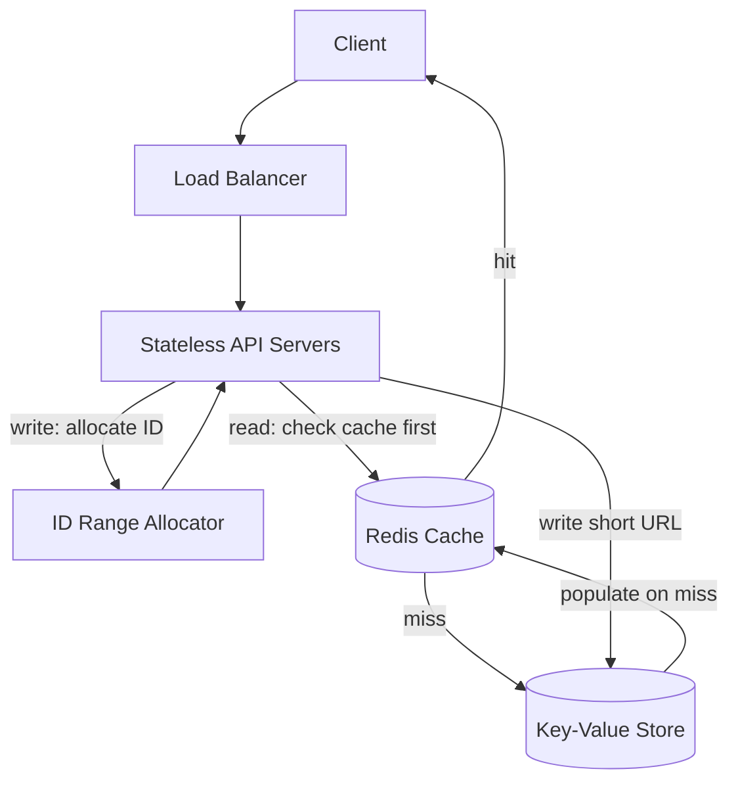

**Database choice:** A key-value store (DynamoDB-style, or OCI's NoSQL equivalent) fits well here - the access pattern is pure key lookups (short_code -> long_url), no complex joins or relational structure needed, and key-value stores scale horizontally more easily than a relational DB for this exact shape of workload.

**Deep dive - the ID generation bottleneck:** A single global auto-incrementing counter becomes a single point of contention at high write volume. The standard fix is ID range pre-allocation - each API server requests a block of, say, 1000 IDs at a time from a coordination service, and hands them out locally without a round-trip per request. This trades a small amount of ID-space waste (if a server crashes mid-block) for removing the counter as a bottleneck entirely.

**Follow-up: what if a short URL needs to expire?**
A: Two approaches - lazy deletion (check expiration on read, delete if expired, accept some storage waste between expiration and cleanup) or active deletion (a background job periodically sweeps expired entries). Lazy deletion alone risks unbounded storage growth from URLs nobody ever reads again to trigger the check, so a production system needs both - lazy check for correctness on the read path, plus a periodic sweep job as a backstop, similar in spirit to the voice bot's DLQ-needs-its-own-alert pattern - a lazy-only mechanism can silently accumulate a problem nothing is actively watching.

**Follow-up: how do you scale the cache when a URL goes viral (hot key problem)?**
A: A single Redis key getting hammered can become its own bottleneck even with caching in place. The fix is read replicas for the cache layer specifically, or at extreme scale, embedding a very short local in-memory cache on each API server for the hottest keys, refreshed periodically - trading a small staleness window for removing the single cache node as a bottleneck, the same latency-vs-freshness tradeoff that showed up in the Colgate caching story.

**Follow-up: how would you change this design if custom aliases needed to be globally unique and reserved atomically (two users racing for the same alias)?**
A: This introduces a real consistency requirement the counter-based approach doesn't have - you need a conditional write (insert-if-not-exists) on the alias itself, which most key-value stores support as a compare-and-swap primitive. The loser of the race gets a clear rejection rather than silently overwriting the winner - correctness here depends on using the database's atomic conditional-write primitive, not a read-then-write pattern in application code, which would have a race condition between the read and the write.

---

### A2. Design a rate limiter

**Requirements clarification:** Functional - limit how many requests a client can make in a time window, reject or queue excess requests. Non-functional - must work correctly across multiple API server instances (not just per-server), must not add significant latency to the hot path, and needs a decision on strict vs approximate accuracy under high concurrency.

**Algorithm options, explained fully with worked examples:**

**Fixed window counter — the simplest mental model, but with a real flaw**

Here's how it actually works: time gets sliced into fixed blocks, like "every 60-second block starting on the minute" — so 12:00:00-12:01:00 is one block, 12:01:00-12:02:00 is the next block, and so on. Each block has its own counter, starting at 0. Every time a request comes in, you bump the counter for whichever block "now" currently falls into. If the counter is already at the limit (say, 100), you reject the request. When the clock ticks over into a new block, that block gets a brand new counter starting at 0 — completely fresh, with no memory of what happened in the previous block.

This is simple to understand and cheap to implement — just one number per client per time block. But here's the flaw, worked through concretely: say the limit is 100 requests per minute, and a client sends 100 requests at 11:59:59 (the very last second of one block) — all 100 are allowed, since that block's counter goes from 0 to exactly 100. Then, one second later, at 12:00:01 (the very first second of the *next* block), the same client sends another 100 requests — and all 100 of *those* are allowed too, because this is a brand new block with its own fresh counter that has no idea what happened in the previous block. Net result: the client got 200 requests through in a 2-second window, double what the "100 per minute" limit was supposed to allow — simply by timing their burst to straddle the boundary between two blocks.

**Sliding window log — fully accurate, but expensive**

Instead of fixed blocks, this approach keeps track of the *actual timestamp* of every single request a client has made recently, stored in a list. When a new request arrives, the system does two things: first, it throws away any timestamps in that list older than 60 seconds ago (since those requests are no longer "recent"), then it counts how many timestamps are left. If that count is under the limit, the request is allowed and its timestamp gets added to the list; if the count is already at the limit, the request is rejected.

The key difference from fixed windows: there's no fixed boundary to game, because the "window" is always defined as "the 60 seconds counting backward from right now" — it continuously slides forward with time rather than resetting at fixed clock marks. So the boundary-burst trick from the fixed window approach simply doesn't work here, since there's no boundary to exploit.

The cost: if a client is allowed, say, 1,000 requests per minute, the system needs to store up to 1,000 individual timestamps for that one client just to correctly enforce the limit — and this multiplied across every client adds up to real memory usage that scales directly with how much traffic you're actually trying to limit. At high request volume across many clients, this becomes genuinely expensive to store and maintain.

**Sliding window counter — a clever approximation that gets most of the accuracy for a fraction of the cost**

This is the practical middle ground production systems typically reach for. Instead of storing every individual timestamp (expensive), it keeps just two numbers per client: a count for the current fixed block, and a count for the immediately previous fixed block. To estimate how many requests happened in the true "last 60 seconds," it doesn't just look at the current block alone — it blends in a *weighted portion* of the previous block's count, based on how much of that previous block's time range still falls within the last 60 seconds.

Worked example: say the block size is 60 seconds, and we're currently 15 seconds into the current block — meaning we're 25% of the way through it, so 75% of the time-range covered by the *previous* block still overlaps with "the last 60 seconds counting back from right now." Say the previous block had 80 requests total, and the current block has 20 requests so far. The estimated sliding-window count is: `(80 × 0.75) + 20 = 60 + 20 = 80`. If the limit is 100, this request is still under the limit, so it's allowed. As time moves forward and we get further into the current block, the weight applied to the previous block's count naturally shrinks toward zero, and the current block's actual count matters more — smoothly, without a hard reset.

This fixes the boundary-burst flaw (there's no sharp reset to exploit, since the estimate blends smoothly across the boundary) while only costing two numbers per client to store, instead of a full list of timestamps — which is why this is the standard real-world choice.

**Token bucket — a different philosophy: allow bursts on purpose, as long as the long-run average holds**

This algorithm works completely differently from the three above, and it's worth understanding as a genuinely different design philosophy, not just another way to count requests. Picture an actual bucket that can hold up to some maximum number of tokens — say, 100 tokens. Tokens get added to this bucket automatically over time, at a steady, fixed rate — say, 10 tokens every second. Every time a request comes in, it must take exactly one token out of the bucket to be allowed through. If there's a token available, take it, allow the request. If the bucket is completely empty, reject the request. If the bucket is already full and tokens are still "arriving" from the refill process, those extra tokens are simply discarded — the bucket never holds more than its maximum capacity.

Here's the behavior this produces, worked through concretely: say the bucket's max capacity is 100 tokens, refilling at 10 tokens/second. If a client makes no requests at all for 20 seconds, the bucket fills all the way up to its cap of 100 tokens (not 200 — it's capped, even though 20 seconds × 10/sec would mathematically be 200). Now suppose that client suddenly sends 100 requests all at once, in the same instant. Every single one of those 100 requests succeeds immediately, because there are exactly 100 tokens sitting in the bucket ready to be spent — a genuine burst, fully allowed in one shot. But the 101st request, coming right after, fails immediately, since the bucket is now empty — it has to wait for tokens to trickle back in at the refill rate of 10/second before more requests can succeed.

This is a fundamentally different guarantee than the sliding-window approaches above. Sliding window log and sliding window counter both enforce a hard rule: "no more than N requests in any T-second span, ever, no exceptions." Token bucket instead enforces: "your long-run average can never exceed the refill rate, but you're explicitly allowed to burst above that rate temporarily, using up tokens you'd saved up during quiet periods." This makes token bucket the right choice specifically when bursty-but-bounded traffic is genuinely legitimate behavior you want to support — for example, a client that's idle most of the time but occasionally needs to send a quick flurry of requests — rather than something you're trying to prevent.

**High-level architecture:** The rate limiter needs to be centralized state, not per-server local state, or a client could just get routed to a fresh server with its own separate counter and bypass the limit entirely. Redis (or a similar low-latency shared store) holding the counters, checked via an atomic increment-and-check operation, is the standard approach - the atomicity matters because a non-atomic read-then-write has the same race condition risk as the URL-alias case above.

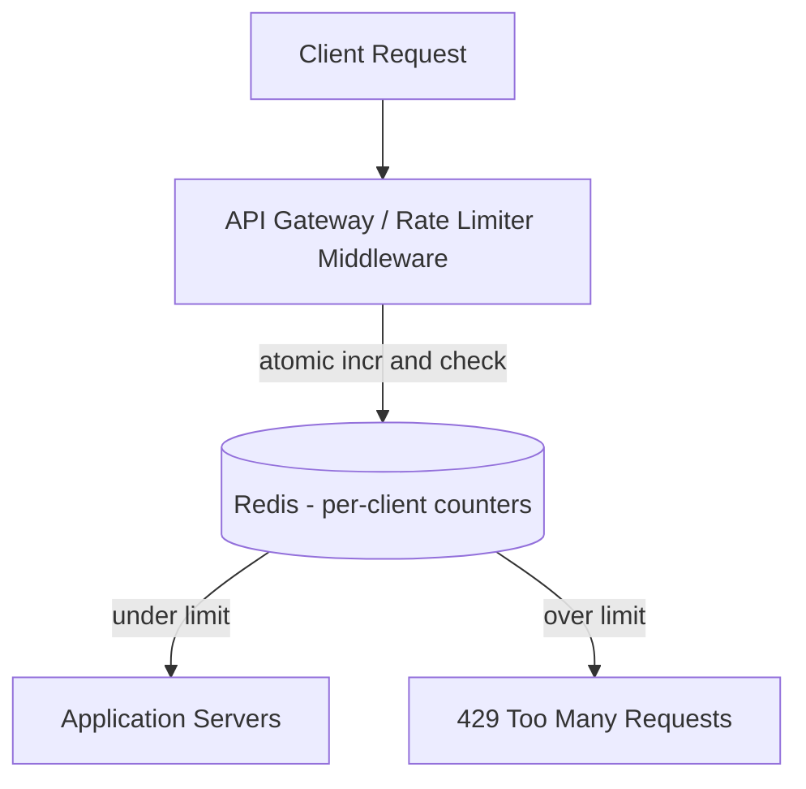

**Deep dive - where does the rate limiter sit in the request path?**
Either as a dedicated middleware/API gateway layer before requests reach application servers (centralizes the logic, adds one hop of latency), or embedded as a library within each service (avoids the extra hop, but means every service needs to correctly implement and stay in sync on the rate-limiting logic). For most systems, a gateway-level limiter is the more maintainable choice - one place to reason about correctness, versus N services each with their own potentially-drifting implementation.

**Follow-up: how do you rate-limit fairly across many different clients without one client's Redis operations slowing down another's?**
A: Key the rate-limit counters per-client (e.g., by API key or user ID) rather than a single global counter, so contention is naturally partitioned. At extreme scale, shard the Redis layer itself by client ID hash, so no single Redis node is handling every client's counter checks.

**Follow-up: the rate limiter's central store (Redis) goes down - what happens to your API?**
A: This is a real fail-open vs fail-closed decision, worth naming explicitly rather than picking silently. Fail-closed (reject all requests when the limiter is unreachable) protects backend systems from being overwhelmed but takes your whole API down over a rate-limiter outage, which is a disproportionate blast radius for a component that's supposed to be a safety net, not a single point of failure itself. Fail-open (allow all requests through) keeps the API available but temporarily removes protection. Most production systems choose fail-open with a fast fallback to a much simpler backup mechanism, like a coarse per-server local limit, so the system degrades gracefully instead of picking one extreme.

---

### A3. Design a distributed alerting/notification platform

**Requirements clarification:** Functional - ingest alerts from many source systems, route them to the right destination (chat, email, SMS, PagerDuty), support per-team configuration of thresholds and channels. Non-functional - alerts must not be silently dropped, delivery should be fast (seconds, not minutes) for critical alerts, and the system must scale to many source systems without a linear increase in integration effort per source.

**High-level architecture:** A Pub/Sub topic handles fan-in from every signal source - SLO burn, config drift, error rate, cost anomaly - into one place. A stateless adapter service subscribes to that topic, reshapes each signal into a destination-specific format, and delivers it, with retry and a dead-letter queue after repeated failures. Delivery routing shouldn't be hardcoded - not every alert goes to the same channel, some need PagerDuty for on-call paging, some need email digests - so routing lives as a rules-evaluation step between ingestion and delivery, keyed off a declarative per-team configuration rather than logic baked into the adapter itself.

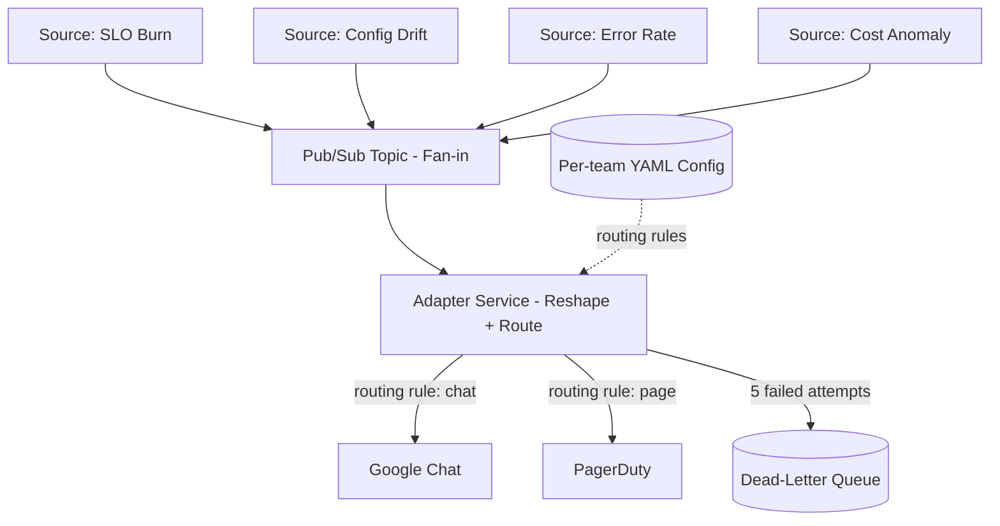

**Deep dive - the DLQ gap:** A DLQ catches failed messages after retries are exhausted, but a DLQ needs its own depth-based alert monitoring it, or a prolonged outage in the delivery destination could mean failures pile up invisibly with nothing surfacing that. That's the honest answer to "how do you know delivery isn't silently failing" - naming a real gap directly is a stronger answer than claiming a design with no gaps at all.

**Follow-up: how would you prevent alert fatigue - the same underlying issue firing thousands of near-duplicate alerts?**
A: Deduplication and grouping at the ingestion layer - a fingerprint derived from the alert's source, metric, and severity (not a raw message hash, since near-duplicate alerts often have slightly different text) lets the system collapse repeated firings of the same underlying issue into a single notification with a "fired N times" counter, rather than N separate notifications. A time-boxed suppression window per fingerprint (don't re-notify for the same issue within, say, 15 minutes) is the standard complementary mechanism.

**Follow-up: a single source system starts sending 1000x its normal alert volume due to a bug on its end - how does your platform stay healthy?**
A: This is exactly the kind of "one bad actor shouldn't take down the shared pipeline" problem multi-tenant systems need to defend against structurally, not hope doesn't happen. Per-source rate limiting at ingestion, keyed the same way as the rate-limiter design above, caps any single source's ability to consume the shared Pub/Sub topic's capacity - the fix is architecturally the same rate-limiting pattern as A2, applied to a different kind of client.

---

### A4. Design an elevator system (real Oracle LLD question - Object-Oriented Design focus)

**Requirements clarification:** How many elevators, how many floors, is this single-building or a design that should generalize? What's the dispatch algorithm's priority - minimize average wait time, or something else? Clarify before designing, since the scheduling algorithm is the heart of the problem.

**Core classes:** `Elevator` (current floor, direction, state - idle/moving/doors-open, a queue of destination floors), `ElevatorController` (owns all elevators, receives external requests, runs the dispatch algorithm), `Request` (origin floor, direction, or a specific destination floor if made from inside the car), `Floor` (up/down call buttons).

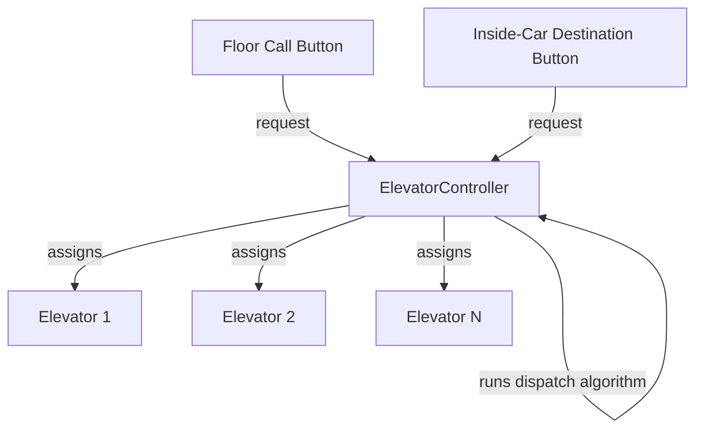

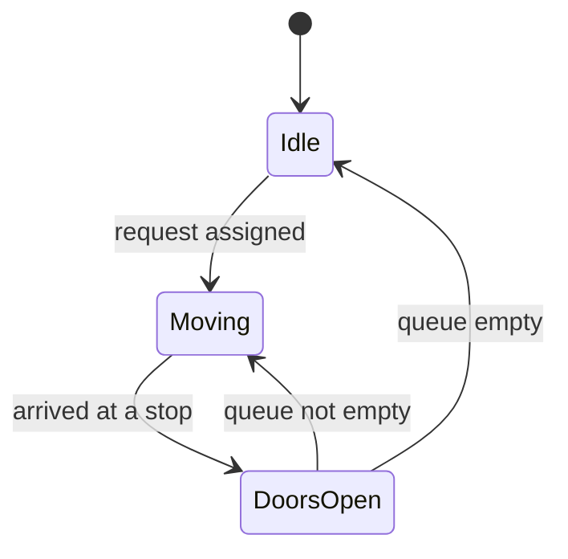

---

**The full verbatim answer - design patterns, code, and class diagram**

**"I'd structure this using four design patterns, each solving a specific problem this system actually has - let me walk through why each one, then show the code."**

**1. Strategy Pattern - for the dispatch algorithm.** "The dispatch algorithm - how we pick which elevator serves a new request - is exactly the kind of thing that should be swappable without touching the rest of the system. Today it might be nearest-elevator-first; tomorrow it might be a SCAN-based algorithm, or a zone-based one at larger scale. I don't want an if/else chain hardcoded into the controller - I want the controller to hold a reference to a strategy object, and the strategy itself is interchangeable."

**2. State Pattern - for elevator behavior.** "An elevator's behavior is genuinely different depending on whether it's idle, moving, or has its doors open - and I don't want one big method with a switch statement on the current state. Each state gets its own class that knows how to handle a 'step forward' event and how to transition to the next state. This keeps state-specific logic contained and makes adding a new state, like a maintenance or emergency-stop state, a matter of adding one new class rather than editing a large conditional."

**3. Observer Pattern - for the controller to react to elevator state changes.** "When an elevator becomes idle, the controller needs to know, so it can check whether any queued requests can now be assigned. Rather than the controller polling every elevator constantly, each elevator holds a list of observers and notifies them directly when it becomes idle - the controller registers itself as an observer of every elevator it manages."

**4. Singleton Pattern - for the controller itself.** "There's exactly one ElevatorController per building - it doesn't make sense to have two independent controllers competing to assign the same elevators. I'd make it a singleton, so the entire system has one authoritative source of truth for dispatch decisions."

**Now the code, in the order I'd actually write it live:**

```python
from abc import ABC, abstractmethod
from enum import Enum
from collections import deque


# --- Enums: explicit state, not boolean flags ---

class Direction(Enum):
    UP = 1
    DOWN = 2
    IDLE = 3

class ElevatorState(Enum):
    IDLE = "IDLE"
    MOVING = "MOVING"
    DOORS_OPEN = "DOORS_OPEN"


# --- Request: what gets passed to the controller ---

class Request:
    def __init__(self, origin_floor, direction, destination_floor=None):
        self.origin_floor = origin_floor
        self.direction = direction
        self.destination_floor = destination_floor  # set once inside the car


# --- Strategy Pattern: interchangeable dispatch algorithms ---

class DispatchStrategy(ABC):
    @abstractmethod
    def select_elevator(self, elevators, request):
        pass

class NearestElevatorStrategy(DispatchStrategy):
    def select_elevator(self, elevators, request):
        best, best_distance = None, float('inf')
        for elevator in elevators:
            if elevator.can_accept(request):
                distance = abs(elevator.current_floor - request.origin_floor)
                if distance < best_distance:
                    best, best_distance = elevator, distance
        return best

class ScanStrategy(DispatchStrategy):
    def select_elevator(self, elevators, request):
        # prefer an elevator already moving toward the request over
        # interrupting an idle one - the SCAN/LOOK approach
        candidates = [e for e in elevators if e.can_accept(request)]
        candidates.sort(key=lambda e: e.estimated_time_to(request.origin_floor))
        return candidates[0] if candidates else None


# --- State Pattern: behavior lives in the state, not in a switch statement ---

class ElevatorStateHandler(ABC):
    @abstractmethod
    def handle(self, elevator):
        pass

class IdleState(ElevatorStateHandler):
    def handle(self, elevator):
        if elevator.destination_queue:
            elevator.state = ElevatorState.MOVING
            elevator.state_handler = MovingState()

class MovingState(ElevatorStateHandler):
    def handle(self, elevator):
        if elevator.current_floor == elevator.next_stop():
            elevator.state = ElevatorState.DOORS_OPEN
            elevator.state_handler = DoorsOpenState()
        else:
            elevator.move_one_floor()

class DoorsOpenState(ElevatorStateHandler):
    def handle(self, elevator):
        elevator.destination_queue.popleft()
        if elevator.destination_queue:
            elevator.state = ElevatorState.MOVING
            elevator.state_handler = MovingState()
        else:
            elevator.state = ElevatorState.IDLE
            elevator.state_handler = IdleState()
            elevator.notify_controller_idle()   # Observer trigger fires here


# --- Observer Pattern interface ---

class ElevatorObserver(ABC):
    @abstractmethod
    def on_elevator_idle(self, elevator):
        pass


# --- Elevator: holds its own state, queue, and observers ---

class Elevator:
    def __init__(self, elevator_id):
        self.id = elevator_id
        self.current_floor = 1
        self.direction = Direction.IDLE
        self.state = ElevatorState.IDLE
        self.state_handler = IdleState()
        self.destination_queue = deque()
        self.observers = []

    def can_accept(self, request):
        return True  # simplified - real version checks capacity/direction fit

    def add_destination(self, floor):
        self.destination_queue.append(floor)

    def next_stop(self):
        return self.destination_queue[0] if self.destination_queue else None

    def move_one_floor(self):
        target = self.next_stop()
        self.current_floor += 1 if target > self.current_floor else -1

    def estimated_time_to(self, floor):
        return abs(self.current_floor - floor)

    def step(self):
        self.state_handler.handle(self)

    def notify_controller_idle(self):
        for observer in self.observers:
            observer.on_elevator_idle(self)


# --- Singleton Pattern: one controller per building ---

class ElevatorController(ElevatorObserver):
    _instance = None

    def __new__(cls, *args, **kwargs):
        if cls._instance is None:
            cls._instance = super().__new__(cls)
        return cls._instance

    def __init__(self, num_elevators, strategy):
        if hasattr(self, '_initialized'):
            return
        self.elevators = [Elevator(i) for i in range(num_elevators)]
        for e in self.elevators:
            e.observers.append(self)          # controller subscribes to every elevator
        self.strategy = strategy
        self.pending_requests = deque()
        self._initialized = True

    def request_elevator(self, request):
        chosen = self.strategy.select_elevator(self.elevators, request)
        if chosen:
            chosen.add_destination(request.origin_floor)
        else:
            self.pending_requests.append(request)   # no elevator free - queue it

    def on_elevator_idle(self, elevator):
        # this is the direct answer to the "what happens when all elevators
        # are busy" follow-up below - re-evaluate now that one freed up
        if self.pending_requests:
            request = self.pending_requests.popleft()
            elevator.add_destination(request.origin_floor)
```

**"A few things worth pointing out about this code as I walk through it:** the `can_accept` check is intentionally simplified here - in a real system it would check the elevator's remaining capacity and whether its current direction is compatible with the request. The `NearestElevatorStrategy` and `ScanStrategy` both implement the same `DispatchStrategy` interface, so swapping between them is a one-line change in the controller's constructor - that's the Strategy pattern actually paying off, not just a naming exercise. And notice `on_elevator_idle` is where the pending-requests queue gets re-drained - that's the Observer pattern directly solving the 'what if all elevators were busy when this request came in' problem, since the controller doesn't need to poll anything, it just reacts the moment an elevator frees up."

**The class diagram - what I'd actually draw on the whiteboard:**

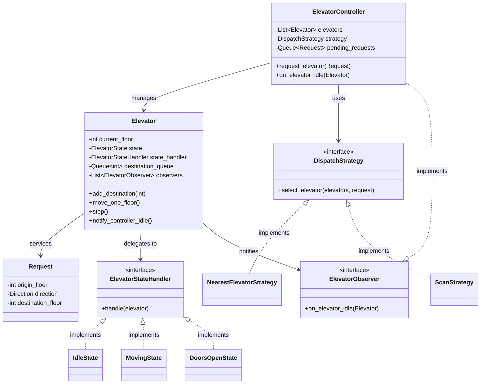

---

**Follow-up: how do you handle a request when all elevators are full or busy?**
A: Queue the request and re-evaluate the assignment once any elevator's state changes (arrives, becomes idle, or its queue shortens) - a request shouldn't be permanently bound to whichever elevator looked best at the moment it arrived, since a better option might open up. This argues for re-running the dispatch decision as an event-driven reaction to elevator state changes, not a one-time assignment at request time.

**Follow-up: how would this design change for a 100-floor building with 20 elevators versus your original design for a small building?**
A: At that scale, the naive "check every elevator" dispatch algorithm's cost grows linearly with elevator count on every request - fine for a handful of elevators, potentially a real bottleneck if dispatch decisions need to happen instantly at high request volume. A zone-based approach (partition elevators to primarily serve floor ranges, similar to how a large building's real elevator banks are often zoned) reduces the search space per dispatch decision, trading some flexibility for scalability - this is the same "does the naive approach still hold at 10x scale" pressure-test as several other questions in this doc.

---

### A5. Design a distributed cache (LRU-based) - ties directly to your DSA prep

**Requirements clarification:** Functional - get/put operations, eviction when at capacity. Non-functional - this version specifically distributed, meaning it needs to work correctly and efficiently when sharded across many machines, not just the single-node LRU you've already drilled for coding rounds.

**Single-node LRU, briefly** (you already know this cold from DSA prep - a doubly linked list plus a hashmap, O(1) get/put): worth stating fast to show it's not new information, then pivoting to what's actually different about the distributed version, since that's what the question is really testing.

**What's different at the distributed level:** Sharding - which node holds a given key. Consistent hashing is the standard answer here specifically because it minimizes redistribution when nodes are added or removed - a naive `hash(key) % N` remaps almost every key when N changes, while consistent hashing only remaps keys in the affected portion of the hash ring.

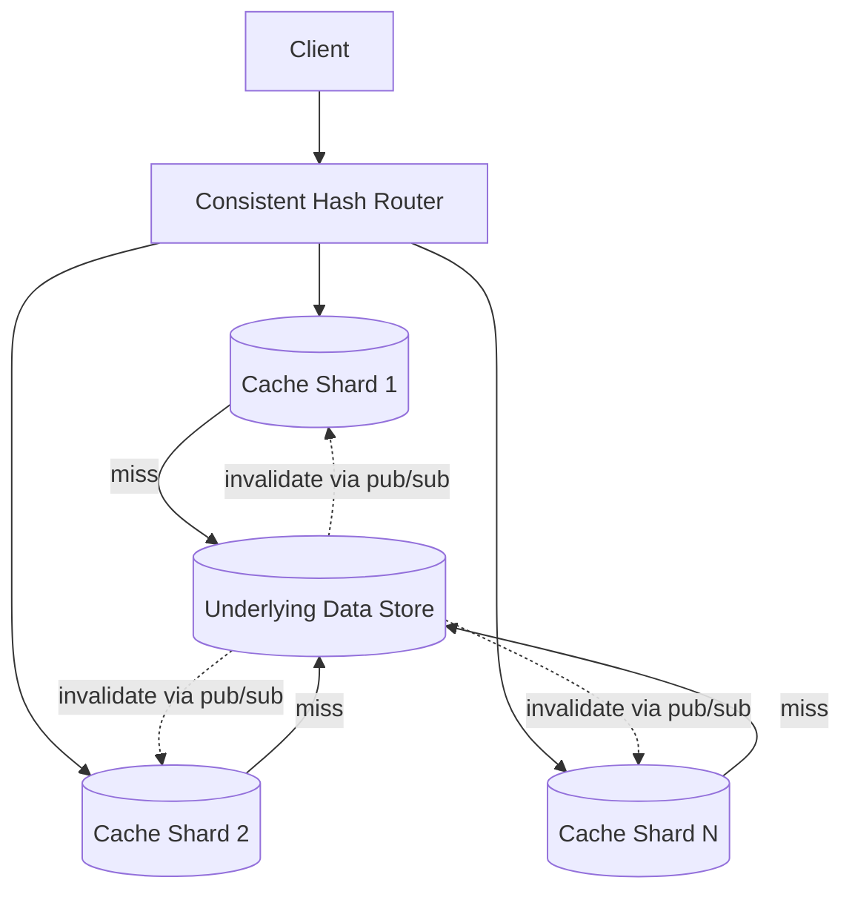

**Deep dive - cache invalidation across shards:** If the underlying data changes, every shard holding a stale copy needs to know. Two approaches: TTL-based expiration (simple, but tolerates some staleness up to the TTL window) or explicit invalidation via a pub/sub broadcast when data changes (fresher, but adds coordination complexity and a dependency on the broadcast actually being reliable). This is architecturally the same tradeoff as Colgate's Kafka-based cache invalidation paired with a TTL backstop - worth explicitly drawing that parallel, since it's a real, defended design decision from your own experience, not just abstract knowledge.

**Follow-up: a shard goes down - what happens to requests for keys on that shard?**
A: Depends on the replication strategy chosen upfront - if each key is replicated to a backup shard (common in production cache clusters), requests fail over to the replica with a brief consistency question (was the replica fully caught up at the moment of failure). If there's no replication, that shard's keys become temporarily unavailable, meaning requests fall through to the underlying data store on every request for those keys until the shard recovers - degraded performance, not incorrect results, which is usually the safer failure mode to design for deliberately.

**Follow-up: how would you handle a hot shard, where one key or a small set of keys gets disproportionate traffic?**
A: Same underlying problem as TinyURL's viral-link follow-up above - consistent hashing distributes keys evenly in expectation but doesn't protect against one specific key being disproportionately popular. The fix is the same pattern: a small local cache in front of the distributed cache for the hottest keys, or explicit key splitting (replicating one hot key across multiple shards and load-balancing reads across the replicas) if the hot-key problem is severe enough to justify the added complexity.

---

## Section B: AI and Agentic System Design Questions

Current 2026 research (a widely-referenced "Agentic AI System Design Interview Guide" plus multiple AI-engineer interview writeups) converges on a clear pattern: interviewers pick 3-5 deep questions rather than many shallow ones, and specifically probe failure modes, tradeoffs, and "what actually breaks in production" - not textbook definitions. The questions below are selected and answered with that bar in mind, connected to your real projects wherever a genuine connection exists.

### B1. Design a production RAG system over a large internal document corpus

**Requirements clarification:** Corpus size (this version: 50M+ internal documents, larger than a typical per-tenant deployment), update frequency (documents added/changed continuously, not a static snapshot), latency target (interactive, sub-few-seconds), and crucially - what's the tolerance for a wrong or unsupported answer, since that shapes the entire grading/fallback design.

**Architecture:** Ingestion pipeline (chunk, embed, index - running continuously as documents change, not just at upload time) -> hybrid retrieval (dense + sparse, fused via RRF) -> grading (is retrieved context sufficient) -> rewrite-and-retry on insufficient context -> generation with citations, or honest fallback.

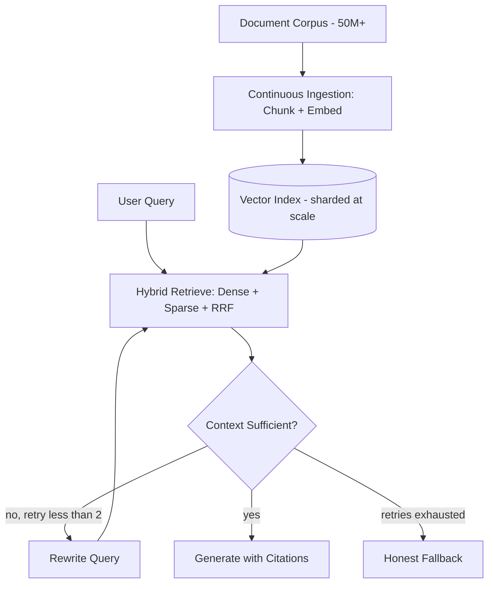

**What genuinely changes at 50M-document scale versus your real per-user corpora:** the vector index itself. pgvector's HNSW index, which works well at the scale Tome Raider actually operates at, starts hitting real limits in the tens of millions of vectors - index build time and memory footprint both grow, and rebuilds can compete with production query load if not scheduled carefully (this is the exact honest answer already established in your deep-dive doc for "when would you revisit pgvector"). At this scale, a dedicated vector database (or a sharded approach) becomes the more defensible choice, not a default assumption that pgvector is always wrong - the crossover point is a real scale-driven decision, not a rule of thumb.

**Deep dive - evaluation, since this is squarely what the JD calls out:** Offline eval against a golden dataset (curated question/expected-answer pairs, ideally spanning the corpus's real topic diversity) measuring both retrieval quality (did the right chunks come back) and generation quality (LLM-as-judge scoring against the retrieved context) separately - splitting these two metrics matters because a wrong answer with good retrieval is a generation-prompt problem, while a wrong answer with bad retrieval is an indexing/chunking problem, and conflating them into one "is the final answer right" metric hides which layer to actually fix.

**Follow-up: the retriever pulls back a document that directly contradicts what the user actually meant - what do you do?**
A: This is the exact "new baseline" question current 2026 interview reports flag as separating senior candidates from RAG-tutorial-level candidates - the wrong answer is "tune the prompt." The right instinct is recognizing this as a retrieval-precision problem, not a generation problem - if the retriever is returning topically-similar-but-wrong documents, the fix belongs upstream of generation: better chunking (a contradiction often means two similar-sounding but distinct entities got merged into a retrieval-ambiguous chunk), metadata filtering (if the corpus has versioned or superseded documents, filtering by recency or an explicit "current" flag before ranking), or a stricter grading threshold that catches "retrieved but contradictory" as a failure case worth rewriting the query over, the same mechanism Tome Raider's grading step already implements for "retrieved but insufficient."

**Follow-up: at 50M documents and high query volume, how do you control cost without degrading quality?**
A: Several real levers, in likely order of impact: caching identical or near-identical queries (Tome Raider already does exact-query caching at 300s TTL; near-duplicate detection via embedding similarity is the natural extension at this scale), routing simple queries to a cheaper/smaller model and reserving the larger model for queries the smaller model's own confidence signal flags as uncertain, and trimming context aggressively - retrieving fewer, higher-precision chunks rather than a wide net that then needs a larger context window (and more tokens) to process.

---

### B2. Design an agent that performs real actions with a hard safety boundary (e.g., a support agent that can issue refunds)

**Requirements clarification:** What actions can the agent take autonomously versus what requires approval? What's the maximum blast radius of a wrong autonomous action (a $5 refund mistake is very different from a $5,000 one)? Is there a hard budget or rate limit on autonomous actions per time window?

**Core architectural principle, stated as the current best-practice framing:** the LLM reasons, the orchestrator controls, a policy engine governs, and a sandbox executes - four distinct components, not one blurred system. This is the same separation-of-concerns instinct behind every one of your own projects' "keep the LLM out of the deterministic path" decisions, just given formal names.

**Concretely, mapped to your own architecture pattern:** every proposed action gets classified by risk tier before execution - read-only actions (checking an order status) execute freely; reversible actions (issuing a small refund under a threshold) execute with logging but no approval gate; irreversible or high-value actions (a large refund, canceling an account) route to human approval. This is structurally identical to EphFlow's bounded decision-primitive design (the agent picks from a small menu, a separate deterministic layer applies the effect) and to the voice bot's compliance gates (pure code vetoes a proposed action before it takes effect) - the same underlying pattern recurring at a third scale, worth naming explicitly.

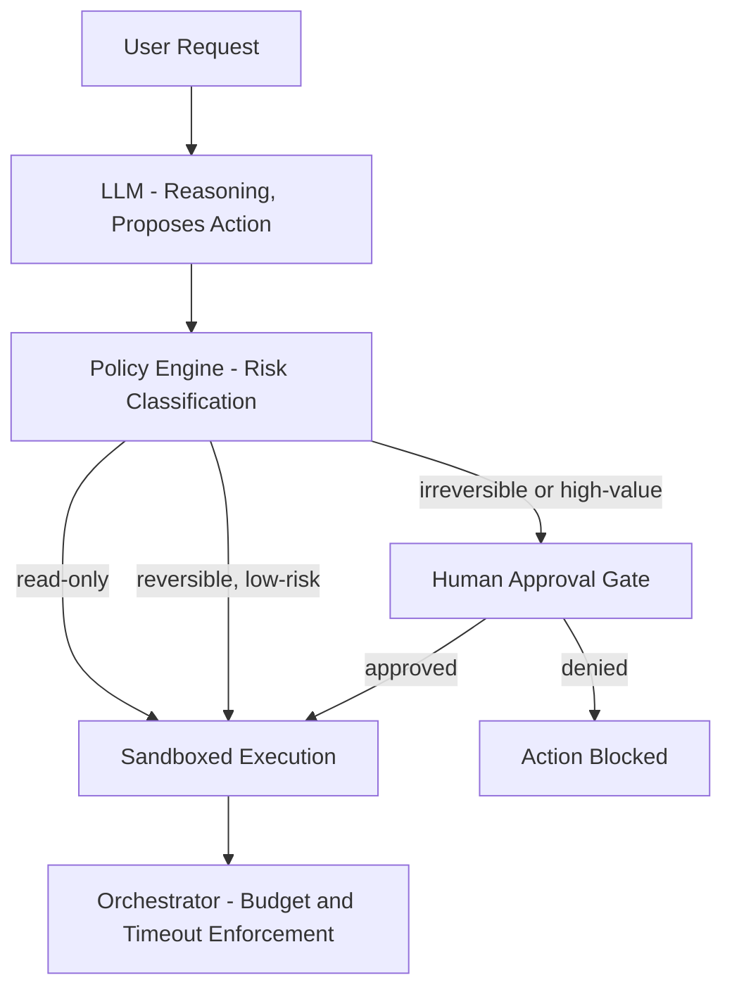

**Deep dive - where do budget and rate limits actually get enforced?** In the orchestrator, never in the prompt. Asking the LLM to "please stay under budget" via system prompt instructions is not enforcement - the LLM doesn't execute anything, it only proposes; the orchestrator is the only component that can actually stop an action from happening, so hard limits (max autonomous-refund-dollars per hour, max actions per session) must live there as code, not as a request the model might or might not honor.

**Follow-up: how do you prevent the agent from being manipulated via a malicious support ticket into taking an action it shouldn't (prompt injection via tool output)?**
A: Tool outputs and retrieved content need to be treated as data, not instructions, structurally - the same principle as Tome Raider's PII/injection screening on inputs, extended to also screen what comes back from tools before it re-enters the model's context. Concretely: a support ticket's text is data the agent reads to decide what to do, never a channel through which new instructions can override the agent's actual policy boundaries - validating that any proposed action stays consistent with the original user's actual request (not something the ticket's content tried to inject) is a real, necessary check, not paranoia.

**Follow-up: how would you evaluate this agent's performance beyond "did it complete the task"?**
A: Task completion alone hides real problems - an agent that succeeds slowly, expensively, or by taking a risky path it got away with isn't actually production-ready. Real metrics beyond completion: efficiency (steps/cost/time per resolved ticket, compared against a simpler baseline to check the agent is actually earning its complexity), safety (rate of actions that hit the approval gate, near-misses where a risky action was proposed but caught), and reliability (does the same ticket type get handled consistently, or does behavior vary run to run in a way that suggests the agent isn't actually reasoning soundly about that category of request).

---

### B3. Design an evaluation harness/platform for agentic systems (directly named in the JD - high priority)

**Requirements clarification:** What's being evaluated - single model outputs, full agent trajectories, or both? Does evaluation need to run pre-deploy (gating a merge) or also continuously post-deploy (monitoring live behavior)? Who defines what "correct" means for a given scenario - programmatic checks, LLM-as-judge, or human review, and does that vary by scenario type?

**Architecture:** A dataset of scenarios - each with an input, and either an expected output, a programmatic verification function, or a rubric for LLM-as-judge scoring. A runner executes the agent or model against every scenario. Results get scored, and scenarios are tiered by severity, so a regression on a critical scenario blocks deployment while a non-critical regression is visible but non-blocking.

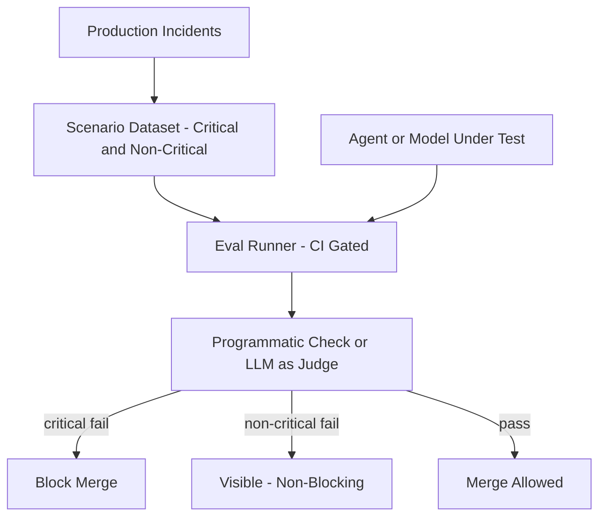

**Deep dive - why programmatic verification beats LLM-as-judge wherever it's possible, and when it isn't:** Programmatic checks (does the output contain the right structured data, did a specific tool get called, does a file exist) are deterministic, cheap, and fast - always prefer them when the success criteria can actually be checked mechanically. LLM-as-judge is necessary specifically when success is inherently about quality of natural language or reasoning, not a checkable fact - and even then, the judge itself needs its own validation (does the judge's scoring correlate with actual human judgment on a held-out sample), since an uncalibrated judge just moves the trust problem one level up rather than solving it.

**Follow-up: how do you keep the evaluation dataset itself from going stale as the product evolves?**
A: This is a real, under-discussed failure mode - a static golden dataset that was comprehensive at launch quietly stops reflecting real usage as the product changes, and a system that's passing all its (outdated) evals can still be failing real users in ways the eval suite doesn't cover. The fix is treating the eval dataset itself as a living artifact - sampling real production interactions (with appropriate privacy handling) as candidates for new scenarios, especially ones where a user had to retry or correct the agent, which is a strong organic signal that a real gap exists that the current suite doesn't catch.

**Follow-up: your eval suite passes, but a new failure mode shows up in production that nothing caught - how do you close that loop?**
A: Any production incident should have a direct, fast path to becoming a new critical-tier scenario in the suite, so the same failure literally cannot regress silently again. The deeper principle worth stating explicitly: an eval suite's job isn't to be complete on day one, it's to be monotonically improving - every real failure discovered in production is raw material for making the suite stronger, and a team that doesn't have that feedback loop wired up is leaving the eval suite to slowly fall behind reality.

---

### B4. Design a multi-agent system, and justify when it's actually the right call versus a single agent

**The justification question, answered honestly first, before any architecture:** multi-agent adds real coordination overhead - shared state complexity, more failure surface, more to observe and debug - and that cost has to be justified by a genuine need, not novelty. The legitimate reasons: the task genuinely needs distinct capabilities or distinct tool access per sub-task (compliance judgment needing a different retrieval source and a stricter threshold than simple Q&A is a good example of that), reliability through failure isolation (one specialist crashing shouldn't take down the whole system), or a generator/critic pattern where one agent's output genuinely benefits from a second agent's independent review. The illegitimate reason, worth naming directly if asked: "it seemed like the more sophisticated answer" - added complexity without a specific problem it solves is a cost, not a feature.

**Architecture:** a supervisor classifies incoming requests and routes to specialists (QA, compliance-judgment, drafting, escalation), all sharing one checkpointed state object, coordinated via a single executor that directly invokes each node in turn rather than independent agents listening for events.

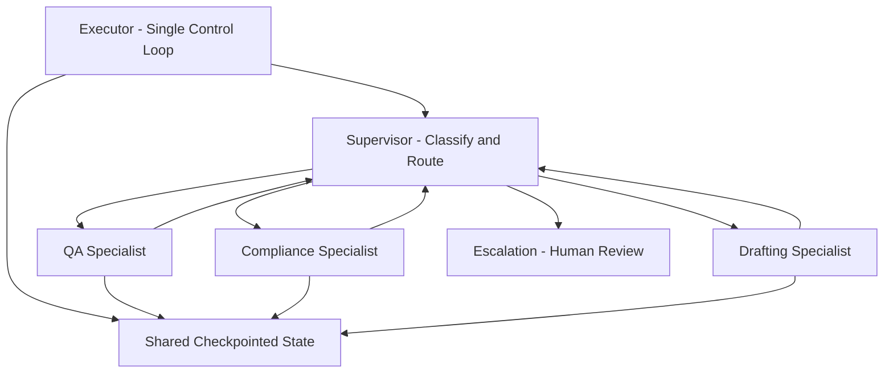

**Deep dive - coordination without conflicting actions, since two agents both trying to act is a real failure mode:** your design avoids this by construction - only one node executes at a time (LangGraph's Pregel-inspired synchronized-superstep model), so there's no scenario where two specialists are simultaneously mutating shared state and racing each other. This is worth stating as a deliberate architectural choice, not an accident - a design that instead let specialists run fully independently and merge results later would need explicit conflict resolution (locking, or a defined priority order for whoever wins a conflict), which your supervisor-mediated design sidesteps entirely by never letting that situation arise.

**Follow-up: how do you debug a failure that only shows up from the interaction between two specialists, not either one alone?**
A: This needs infrastructure beyond normal single-component logging - a correlation ID that propagates through the entire request across every specialist it touches, so every log line from a single user request is traceable back to one thread, plus full visibility into the shared state at each step (what did the compliance specialist actually see when it read the QA specialist's earlier finding). A checkpointer's per-step state history is exactly the trace a debugging session would need to walk backward through, especially paired with a tracing tool like LangSmith that captures each node's input and output against that same shared state.

**Follow-up: what emergent behavior risk is specific to multi-agent systems that a single-agent design doesn't have?**
A: Agents can develop coordination failures that don't exist in a single-agent system by construction - for example, two agents handing a task back and forth to each other indefinitely, each believing the other should act next, which is a structural loop that's easy to fall into without single-executor synchronization enforcing whose turn it actually is. Your design's single-executor model directly prevents this specific failure mode, since there's no ambiguity about which node runs next - it's always exactly whatever the last Command's goto field said, never two nodes racing to decide independently.

---

### B5. What logic belongs in the orchestrator versus the LLM? (a conceptual question, asked standalone or as a follow-up to any agent design)

**The general principle:** anything that must be guaranteed belongs in the orchestrator, as enforced code. Anything that requires judgment belongs in the LLM. The orchestrator handles loop control, timeout enforcement, budget tracking, state persistence, and error handling. The LLM handles interpreting the goal, choosing an approach, and generating the specific content or arguments for an action.

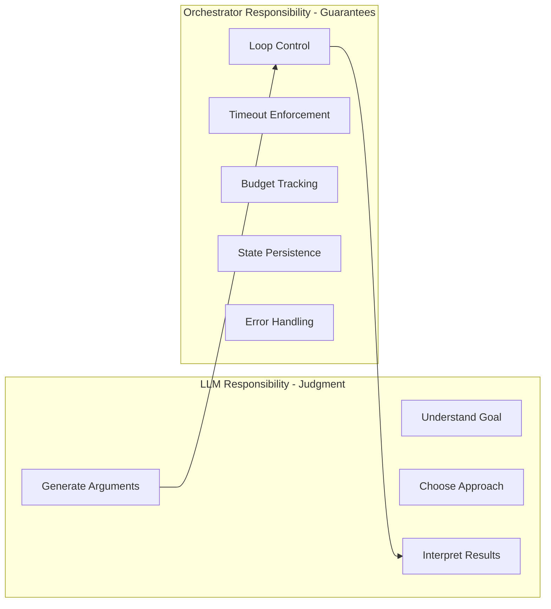

**Your own concrete example - use this instead of a generic answer:** EphFlow's agent layer picks a decision primitive (reassign_platform, flip_requires_vm, escalate) - that's the LLM's judgment call, genuinely requiring reasoning about a failure signature. But the actual mutation of the workflow JSON, and the re-validation of that mutation against the same schema and DAG rules any human submission goes through, is deterministic code the agent never touches. That's a real, already-built instance of exactly this principle, not a hypothetical.

**The anti-pattern worth naming if asked what goes wrong when this line gets blurred:** putting control flow inside a prompt - telling the model "keep trying until you solve this" hands the model authority over when to stop, which is precisely how runaway loops and unbounded cost happen in production, since the model has no hard stop besides its own judgment, and a model that's wrong about being done just keeps going.

---

## Section C: Universal follow-up patterns - applicable to almost any design above

These are the question shapes that tend to recur regardless of which specific system you're designing - worth having a default answer pattern ready for each, since Arshdeep's "Expect and Embrace Change" tag makes it likely he'll pull one of these mid-design rather than staying on the original prompt.

**"What if this needs to scale 10x?"** - Identify the component that breaks first, specifically (not "everything gets harder"). For most designs above, that's either a single coordination point (a global counter, a single Redis instance) or a naive linear-scan operation that was fine at small scale. Name the specific bottleneck, then name the specific fix (sharding, ID range pre-allocation, zone partitioning) rather than a vague "we'd add more servers."

**"What if [key component] goes down?"** - Have a specific answer for graceful degradation, not just "we'd have redundancy." Distinguish fail-open versus fail-closed explicitly, and justify which one fits the specific system's actual risk profile (a rate limiter can fail open with acceptable risk; a payment-authorization check generally can't).

**"How would you migrate this design to [new constraint] without downtime?"** - The general pattern worth having ready: dual-write or shadow-mode operation during transition (write to both old and new systems, read from old, compare results), then cut over reads once the new system is validated, then stop writing to the old system last. This is the same pattern already used in the EphFlow LangChain layer's re-registration approach and is a generally strong default answer for any "how do you change a live system safely" question.

**"What's the actual cost of this design, and how would you reduce it?"** - Always have a real number-shaped answer ready, even approximate - which component dominates cost (compute, storage, or LLM API calls, for AI systems specifically), and the standard lever for that specific cost driver (caching for repeated computation, cheaper model routing for LLM calls, tiered storage for cold data).

**"Walk me through what happens on the unhappy path"** - Interviewers watching for whether you designed the failure path deliberately or only ever described the happy path. Have at least one concrete failure scenario ready to narrate for whatever you just designed, unprompted if time allows - it signals the same instinct already shown throughout your own real systems (the honest fallback, the DLQ, the escalation tier).

---

## Final notes

- Lead with real project connections wherever they exist (B1, B2, B3, B4 all have genuine, defensible ties to Tome Raider, the voice bot, and EphFlow) - a design question you can partially answer from lived experience is stronger than a purely theoretical one, and Arshdeep's round is exactly where that experience should visibly show up.
- For the classic questions (Section A), the Oracle-specific move that multiple sources independently confirmed: name the actual OCI service equivalent when relevant (OCI Object Storage, OCI Streaming, OCI NoSQL Database) rather than defaulting to AWS/GCP naming out of habit.
- If Arshdeep changes a requirement mid-design (very likely, given his tag), narrate the change explicitly rather than silently redrawing - "given that new constraint, the bottleneck shifts from X to Y, so I'd change Z" shows the adaptation itself, which is what's actually being evaluated.
- This document covers System Design specifically. Coding & Problem Solving (the other half of Arshdeep's tag) is covered by your existing `Oracle_DSA_Answering_Guide.md`.
